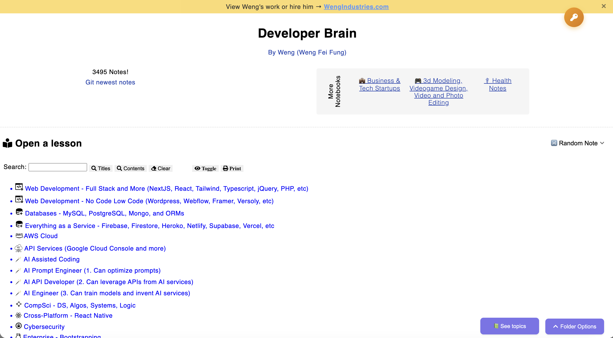

# Anti-Scraping Hardening — A Story



This is the chronological story of how this app went from "Hostinger suspended my account because of bot CPU spikes" to "CPU near 0% under the same kind of attack." Each move below links to the README that documents the actual code/config for that mitigation, so this file stays a narrative — the technical details live next door.

Companion READMEs referenced throughout:

- [README - Protect MD Files Guide.md](README%20-%20Protect%20MD%20Files%20Guide.md) — block direct `.md` URLs, serve note content through a PHP endpoint instead.
- [README - Throttle Note Requests.md](README%20-%20Throttle%20Note%20Requests.md) — per-IP rate limit on the PHP endpoint, with the Cloudflare / CloudPanel IP-resolution gotchas spelled out.
- [README - Cache Strategies Implementation.md](README%20-%20Cache%20Strategies%20Implementation.md) — `ETag` + conditional-GET so revisits cost a 304, plus pre-compressed gzip + brotli for first-load bodies.

---

## The trigger

I have this web app full of coding notes (the engine itself is described in [README.md](README.md)). After a few years online, scrapers found it and started hammering — no cool-down between requests. Logs showed it wasn't one bot; new bots kept arriving as old ones finished, the way a botnet behaves.

The brain notes weren't even the only thing slowing down — the rest of my site dragged with them, and the VPS CPU pinned at 100% often enough that **Hostinger suspended my account**. That was the wake-up call.

## Move 1 — Put it behind Cloudflare (too late)

The obvious answer was Cloudflare. I enabled the orange cloud, expecting the edge to absorb the abuse. It didn't, because the bots already knew my origin IP from before I'd added Cloudflare. They walked around the edge entirely and kept hitting the box directly.

Origin IPs leak through more channels than people assume — historical DNS, certificate transparency logs, mail headers, Shodan/Censys cert correlation. Once it's out, you can't put it back. See the "How scrapers find your origin IP" section of [README - Throttle Note Requests.md](README%20-%20Throttle%20Note%20Requests.md) for the full list.

Hostinger wouldn't issue a new IP. So I moved providers.

## Move 2 — New VPS at Hetzner with a clean IP

Hetzner gave me network flexibility Hostinger didn't. The important part wasn't the provider switch itself — it was the order of operations:

> **I did not expose the public domain until Cloudflare was fully set up.**

That meant the origin IP never appeared in any DNS record, mail header, or cert linked to the public hostname. The botnet's stale lookups never resolved to the new box.

This is the foundation everything else relies on. A throttle, WAF, or CDN rule is only as strong as your origin's reachability profile. Lock direct-to-origin down, then everything above it has teeth.

## Move 3 — Geo-block to the US

Cloudflare's default bot mitigation blocked a lot but not enough. CPU was still spiking from sheer concurrent traffic, much of it from regions my users don't come from. My audience is US-only, so I added a Cloudflare Security Rule that blocks all non-US traffic.

> **Decide before reaching for this**: do you have a global audience or international customers? If yes, geo-blocking isn't an option, and you'll need to lean harder on the next moves.

## Move 4 — Non-interactive challenge on the app URL

US-based bot traffic still pushed Nginx to ~20% CPU. Cloudflare wasn't detecting all suspicious IPs/bots in the US. I added a Cloudflare Managed Challenge (non-interactive) on the app's URL. Real browsers solve it transparently; headless scrapers without a JS engine usually fail.

## Move 5 — Stop serving `.md` files directly

The brain content is a folder of Markdown files. The frontend used to fetch each `.md` directly, which is exactly the URL pattern a scraper enumerates: `/notes/a.md`, `/notes/b.md`, … pull the whole corpus.

The fix came in two halves:

1. The frontend now opens notes through a PHP endpoint (`local-open.php`) that resolves and renders the file server-side. Browser code never sees a `.md` URL.
2. The Nginx vhost blocks direct `.md` requests outright.

→ **Implementation: [README - Protect MD Files Guide.md](README%20-%20Protect%20MD%20Files%20Guide.md)**

Bot logs immediately showed huge volumes of direct `.md` requests now 404'ing. This single move was the biggest single drop in load.

## Move 6 — PHP-level throttle on the rendering endpoint

Closing the `.md` URL meant the PHP endpoint was now the only chokepoint into note content — which is also exactly where a smart scraper would aim next. So I added a per-IP sliding-window rate limit to `local-open.php`: 4 requests per 30 seconds, 429 with a friendly cooldown message above that.

→ **Implementation: [README - Throttle Note Requests.md](README%20-%20Throttle%20Note%20Requests.md)**

That README also covers the Cloudflare-correctness gotcha behind a CDN: `REMOTE_ADDR` is a Cloudflare edge IP, so without reading `CF-Connecting-IP` you'd throttle every visitor against the same shared bucket.

## Move 7 — Make returning visitors free with conditional GETs

The largest things on the page are the topic model JSON (~2.5 MB) and the pre-rendered topic tree HTML (~2 MB). I told browsers to cache them locally but always revalidate against the server:

```
Cache-Control: no-cache, must-revalidate
ETag: <hash>
```

Translation: *"store it, but check first."* On every revisit the server answers `304 Not Modified` (no body) unless the file has actually been rebuilt.

One Cloudflare-specific gotcha I hit: Cloudflare's edge caches by default and will serve its own cached copy without consulting the origin's `ETag`. So a `.md` rebuild on the origin wouldn't reach revisiting users until Cloudflare's cache expired. The fix was a Cloudflare cache-bypass rule for those specific files, letting the origin handle the conditional GET directly. The rest of the site keeps Cloudflare caching as normal.

→ **Implementation: [README - Cache Strategies Implementation.md](README%20-%20Cache%20Strategies%20Implementation.md)**

After this layer, CPU dropped from ~20% to ~5%.

## Move 8 — Pre-compress the large files with gzip + brotli

Cache misses still exist — first visits, freshly built files, regions Cloudflare hasn't warmed yet. Those send the full body. The cached files are highly redundant text (repeated HTML structure, repeated JSON keys), so brotli at quality 11 takes the ~2 MB HTML down to ~100 KB. About a 95% cut.

A build step writes `.br` and `.gz` variants alongside each cached file, and the server picks whichever variant the client accepts. The URL never changes — `cachedResPartial.html` stays `cachedResPartial.html` in the browser; the `.br` suffix is a server-internal filename only. The browser decompresses transparently. No frontend code change.

→ **Implementation: [README - Cache Strategies Implementation.md §7](README%20-%20Cache%20Strategies%20Implementation.md)** — and **§8 of that same file** explains why you'll see `Content-Encoding: zstd` (not `br`) in DevTools when behind Cloudflare, and why pre-compressing at the origin is still worth it even though Cloudflare re-encodes on the way out.

> **Cheap path for your own site**: just enable `gzip on;` and `brotli on;` in Nginx (or `mod_deflate` / `mod_brotli` in Apache). That covers most of the gain. Pre-compressing at build time is what makes the savings *maximal*, but on-the-fly compression alone is already a big win.

## Result

CPU now sits near 0% under the same kind of traffic that used to peg it at 100%. Fewer illegitimate connections reach the app at all, and the ones that do get throttled before they cost real work.

The single biggest takeaway: **Cloudflare alone wasn't enough**. Even with default bot protection plus a geo-rule, scrapers got through. What worked was the layered combination — clean origin IP + Cloudflare + geo-block + challenge + closed `.md` URLs + PHP throttle + browser cache + pre-compressed bodies. Each layer makes the next one cheaper.

## Highest-leverage moves first

If you can only borrow one or two of these, the priority order is:

1. **[Protect MD Files Guide](README%20-%20Protect%20MD%20Files%20Guide.md)** — closes the obvious scraping URL pattern. Biggest single drop.
2. **[Throttle Note Requests](README%20-%20Throttle%20Note%20Requests.md)** — caps the cost of the new chokepoint.
3. **[Cache Strategies Implementation](README%20-%20Cache%20Strategies%20Implementation.md)** — turns returning visitors into 304s, plus shrinks first-load bodies by ~95% with pre-compression.

The rest (clean origin IP, geo-block, Cloudflare challenge, cache-bypass rule) is configuration on the provider/CDN side — important, but not in this repo.
