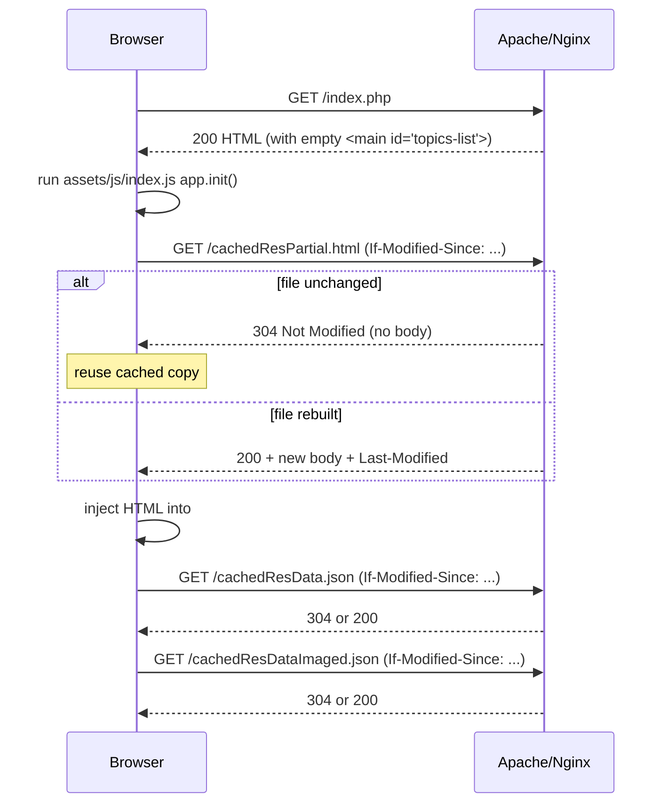
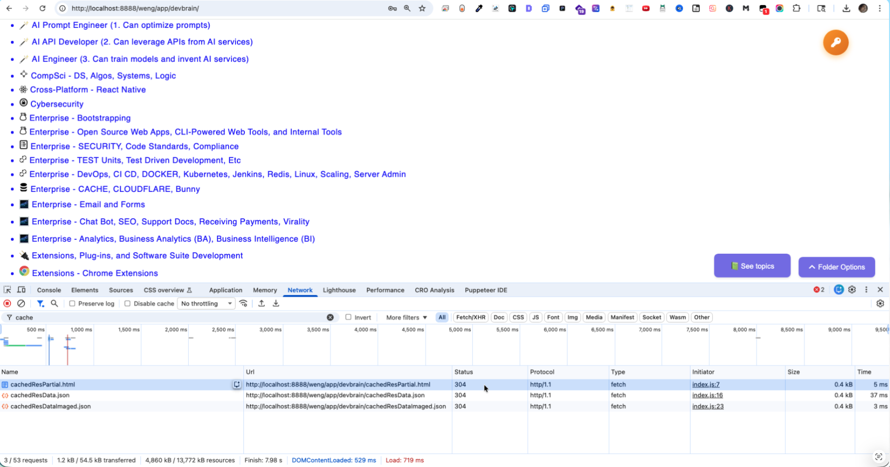
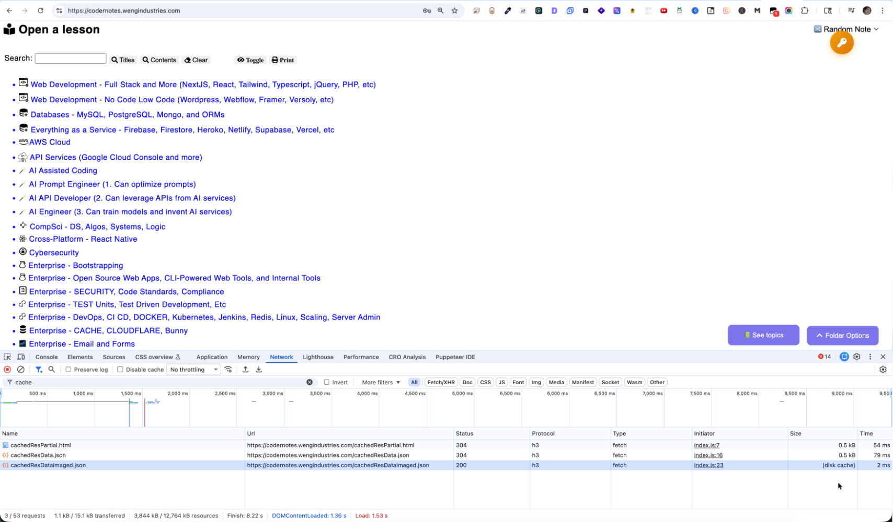
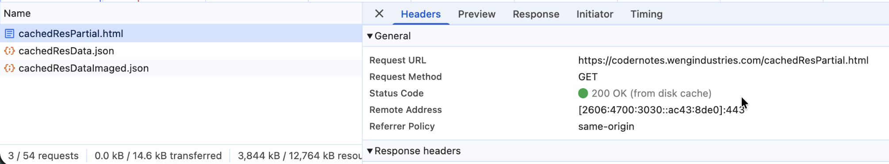
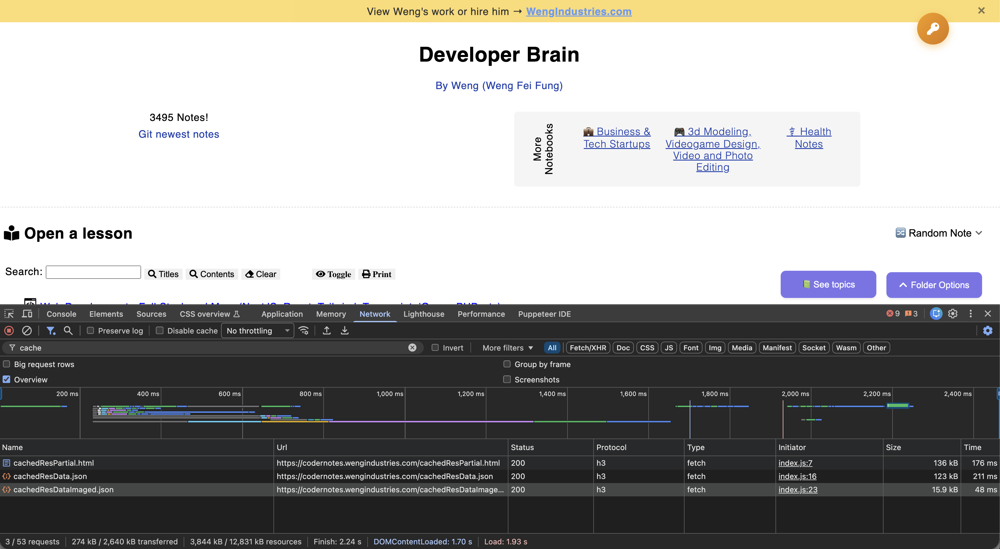
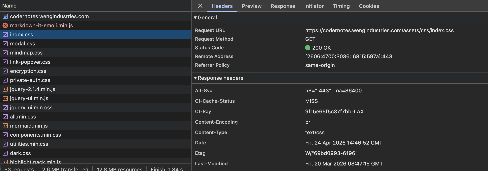
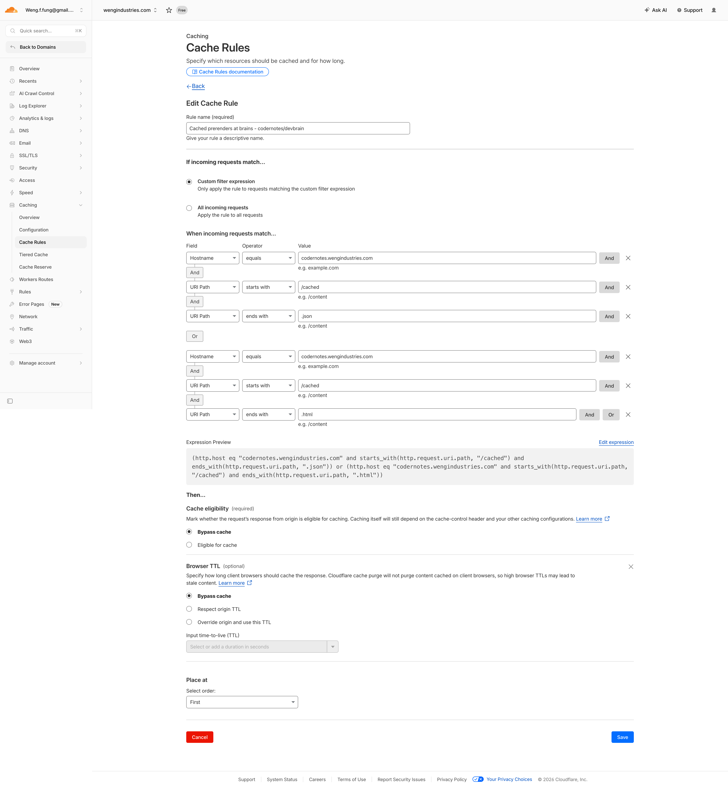
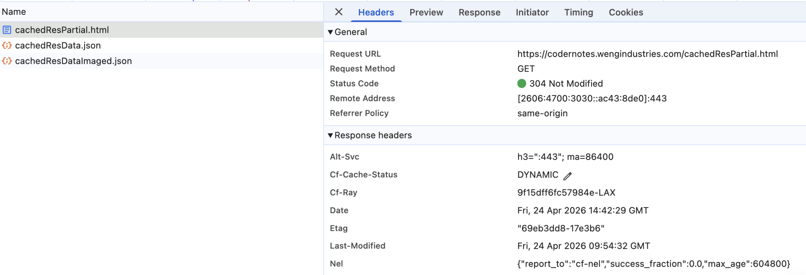
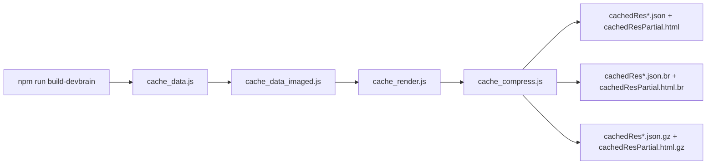

# Cache Strategies Implementation

This guide explains the three generated "cache files" at the repo root, how the browser caches them, and how to configure Apache or Nginx so caching behaves correctly. For the companion topic of gzip/brotli compression, see the section at the bottom.

---

## 1. What the cache files are

There are three files at the repo root whose names start with `cached`. They are all **generated artifacts** — never edit them by hand. They are rebuilt by `npm run build-<brain>` (see [package.json](package.json)).

| File | Built by | Size (current) | Purpose |
|---|---|---|---|
| [cachedResData.json](cachedResData.json) | [cache_data.js](cache_data.js) | ~2.5 MB | Full file tree of `curriculum/` — folders, notes, paths, IDs, sort spec. Used by the frontend for random-note, search, and folder-path lookups. |
| [cachedResDataImaged.json](cachedResDataImaged.json) | [cache_data_imaged.js](cache_data_imaged.js) | ~260 KB | Subset of the tree containing only notes that have images. Used to prioritize "Random Note" toward visually rich notes. |
| [cachedResPartial.html](cachedResPartial.html) | [cache_render.js](cache_render.js) | ~2.0 MB | Pre-rendered topics-tree HTML (`<ul class="ul-root">…`) that populates `<main id="topics-list">` on the page. |

Note the naming split:
- **`cache_*.js`** — Node build scripts that _generate_ the cache files. These are source code, not cached data. They are NOT the targets of browser caching.
- **`cachedRes*`** — generated output files, served to the browser.

The `.htaccess` / Nginx rules below match `^cached.*` so they catch the outputs but never the generator scripts.

## 2a. How they are served

Before the current setup, `cachedResPartial.php` was `include()`-ed server-side into [index.php](index.php). That meant every page load re-sent the full 2 MB tree as part of the HTML response, which the browser could not cache separately.

The flow is now:



Key points:
- [index.php](index.php) line ~275 renders `<main id="topics-list">` as an empty container.
- [assets/js/index.js](assets/js/index.js) `app.init()` fetches `cachedResPartial.html`, injects it, sets `window.__topicsReady = true`, then dispatches a `topics-ready` event.
- Other scripts ([assets/js/note-opener.js](assets/js/note-opener.js), [assets/js/link-popover.js](assets/js/link-popover.js), [assets/js/private-auth.js](assets/js/private-auth.js), and `initFolderOptionsAndAI` in [assets/js/index.js](assets/js/index.js)) defer their DOM setup until `topics-ready` fires.

## 2b. What it looks like

**First run**, status code is 200 (note you need to have Network tab opened as page loads to properly log files as they load in):


**Subsequent revisits** or **refresh** - status 304:
Status 304 (Not Modified) is an HTTP redirection response code indicating that a requested resource has not changed since it was last accessed, allowing the client to use a cached version from their web browser.



**Test further:**
With the Network panel opened, if you hit CMD+SHIFT+R instead of CMD+R, it’ll clear the cache and reload, going back to 200 statuses

  

## 3. Cache strategy: conditional revalidation

We want: **"use the browser's stored copy unless the file's last-modified timestamp differs."**

This is implemented with HTTP **conditional GET**, not with a long `max-age`:

1. On the first request, the server returns `200 OK` with `Last-Modified: <mtime>` and `ETag: <hash>`.
2. The browser stores the body.
3. On every subsequent request, the browser sends `If-Modified-Since: <that mtime>` and `If-None-Match: <that etag>`.
4. The server stats the file:
   - mtime/etag match → **`304 Not Modified`**, empty body, ~200 bytes on the wire. Browser serves its stored copy.
   - mtime/etag differ → **`200 OK`** with the new body and new headers.

The header that makes this happen is:

```
Cache-Control: no-cache, must-revalidate
```

Despite the name, **`no-cache` does NOT mean "don't cache"** — it means "you may store, but you must revalidate with the server before reusing." This is exactly the behavior we want. `must-revalidate` adds a safety rule that stale responses must never be served if the server is reachable.

We deliberately do NOT use `max-age=<large>`, because that would let the browser reuse stale data for up to that many seconds without asking the server — meaning a rebuild of the cache files wouldn't be picked up until the TTL expires.

## 4. Cache 200 and 304 Strategy - Apache setup (.htaccess)

The config lives in [.htaccess](.htaccess) at the repo root. Apache automatically emits `Last-Modified` and `ETag` for static files; we only need to set `Cache-Control` and pin the ETag algorithm.

```apache
# Browser cache policy for generated cache outputs.
#
# Target files (at repo root):
#   cachedResData.json
#   cachedResDataImaged.json
#   cachedResPartial.html
#
# Strategy: conditional-GET revalidation.
# Apache auto-emits Last-Modified + ETag for static files. "no-cache" here
# means the browser MAY store the response but MUST revalidate with the server
# on each request. When the file's mtime is unchanged, Apache answers 304 and
# the browser serves its cached copy. When the file has been rebuilt (e.g. by
# `npm run build-devbrain`), its mtime changes and the browser gets the fresh
# body. This gives us "use the browser's copy unless the last-modified differs".
<IfModule mod_headers.c>
    <FilesMatch "^cached.*\.(json|html)$">
        Header set Cache-Control "no-cache, must-revalidate"
        Header unset Pragma
        Header unset Expires
    </FilesMatch>
</IfModule>

# Make ETag strong by basing it on mtime + size (no inode, so it survives
# filesystem moves / replicas).
FileETag MTime Size
```

### Requirements
- Apache 2.4+ (any mainstream shared host).
- `mod_headers` enabled — the `<IfModule>` guard makes the block a no-op if it's not, but then `Cache-Control` won't be set. Check with `apachectl -M | grep headers` or just look at response headers.
- `AllowOverride` must permit `FileInfo` and `Indexes` for the directory, or `.htaccess` directives are ignored. On shared hosts this is usually already allowed for the docroot.

### Verifying on Apache

```bash
# First request: should return 200 and Cache-Control
curl -sI https://your.host/app/devbrain/cachedResPartial.html

# Conditional request: should return 304 with no body
curl -sI -H 'If-Modified-Since: Wed, 01 Jan 2020 00:00:00 GMT' \
  https://your.host/app/devbrain/cachedResPartial.html
# ^ Using a future date would get 304; using a very old date gets 200.
#   Copy the actual Last-Modified from the first response to test 304 cleanly:
LM=$(curl -sI https://your.host/app/devbrain/cachedResPartial.html | awk -F': ' '/^Last-Modified/{print $2}' | tr -d '\r')
curl -sI -H "If-Modified-Since: $LM" https://your.host/app/devbrain/cachedResPartial.html
```

Expected on the conditional request:
```
HTTP/1.1 304 Not Modified
Cache-Control: no-cache, must-revalidate
ETag: "..."
```

In browser DevTools → Network, you should see a ~200-byte `304` response on reloads, and the body column labelled "(disk cache)" or "(memory cache)".

## 5. Cache 200 and 304 Strategy - Nginx setup (server block / vhost)

Nginx doesn't read `.htaccess`; configuration lives in your site file, typically `/etc/nginx/sites-available/<site>.conf` or `/etc/nginx/conf.d/<site>.conf`. Add a `location` block inside the `server { ... }` that serves this app:

```nginx
server {
    listen 443 ssl http2;
    server_name your.host;
    root /var/www/your.host/app/devbrain;
    index index.php index.html;

    # ... your existing PHP handler, SSL config, etc ...

    # Conditional-GET revalidation for generated cache outputs.
    # Nginx auto-emits Last-Modified; enabling etag on (default in 1.3.3+) pairs well.
    # "no-cache" tells the browser to store but always revalidate.
    location ~* ^/cached.*\.(json|html)$ {
        add_header Cache-Control "no-cache, must-revalidate" always;
        add_header Vary "Accept-Encoding" always;
        etag on;
        # Nginx sends 304 automatically when If-Modified-Since / If-None-Match match.
    }
}
```

After editing, reload Nginx:

```bash
sudo nginx -t          # syntax check
sudo systemctl reload nginx
```

### Notes for Nginx
- `etag on;` is the default in Nginx ≥ 1.3.3 but including it explicitly is self-documenting.
- Use `add_header … always` so the header is sent on both `200` and `304` responses. (Without `always`, Nginx suppresses `add_header` on non-2xx/3xx responses in older versions.)
- If you also use `gzip on;` or `brotli on;`, Nginx handles the ETag / `Vary` interaction correctly on modern versions. Keeping the `Vary: Accept-Encoding` header explicit prevents any proxy from serving a compressed body to a client that didn't ask for it.
- If this app lives under a URL prefix (e.g. `/app/devbrain/`), the `location` regex matches the URI path, so either anchor it to your prefix or use a nested `location`:
  ```nginx
  location /app/devbrain/ {
      location ~* ^/app/devbrain/cached.*\.(json|html)$ {
          add_header Cache-Control "no-cache, must-revalidate" always;
          etag on;
      }
  }
  ```

### Which server block on multi-block setups (CloudPanel, Plesk, reverse-proxy)

CloudPanel and many panel-managed hosts split Nginx into two server blocks:

- **Port 443** — the public-facing Nginx. Terminates SSL, serves static files (images, CSS, JS, JSON, HTML) directly from disk, and reverse-proxies only the PHP requests to the backend.
- **Port 8080** — an internal backend (another Nginx or Apache) that talks to `php-fpm` and returns the rendered PHP output. It never sees static-file requests in the default setup.

Our three files — `cachedResData.json`, `cachedResDataImaged.json`, `cachedResPartial.html` — are **static files**. They're served straight from disk by the 443 block. So:

**Put the `location ~* ^/cached.*\.(json|html)$` block in the 443 server block, not the 8080 one.**

If you put it in 8080 only, the 443 front-end happily serves the file without any `Cache-Control` header, because it never consulted the 8080 config for static paths. That's the "I added it but nothing changed" trap.

On CloudPanel the file is typically:

```
/etc/nginx/sites-enabled/<domain>.conf
```

and contains something like this (abridged; CloudPanel's real config is longer):

```nginx
# === 443: public-facing, serves static + proxies PHP to 8080 ===
server {
    listen 443 ssl http2;
    server_name your.host;
    root /home/<site-user>/htdocs/your.host;

    # ... SSL, security headers, etc ...

    # Static files are served here — add the cache headers HERE
    location ~* ^/app/devbrain/cached.*\.(json|html)$ {
        add_header Cache-Control "no-cache, must-revalidate" always;
        add_header Vary "Accept-Encoding" always;
        etag on;
    }

    # PHP goes to the backend on 8080
    location ~ \.php$ {
        proxy_pass http://127.0.0.1:8080;
        proxy_set_header Host $host;
        proxy_set_header X-Real-IP $remote_addr;
        proxy_set_header X-Forwarded-For $proxy_add_x_forwarded_for;
        proxy_set_header X-Forwarded-Proto $scheme;
    }
}

# === 8080: internal PHP backend — nothing to do here for our cache files ===
server {
    listen 127.0.0.1:8080;
    server_name your.host;
    root /home/<site-user>/htdocs/your.host;

    location ~ \.php$ {
        include snippets/fastcgi-php.conf;
        fastcgi_pass unix:/run/php/php8.x-fpm-<site-user>.sock;
    }
}
```

Rules of thumb for two-tier Nginx:

- **Static-file headers (caching, compression, CORS for static assets)** → public-facing 443 block.
- **PHP-response headers (session cookies, dynamic `Cache-Control`, security headers on PHP pages)** → can go in either block, but the public 443 block is the one the browser sees, so it wins. CloudPanel often sets `proxy_pass_header` / `proxy_pass_request_headers` so backend headers propagate, but setting them on 443 is the most predictable.
- **Compression (`gzip on;`, `brotli on;`)** → 443 block. The body only needs to be compressed once, right before it leaves the server to the client.

Two telltale signs that you edited the wrong block:

```bash
# Should show your Cache-Control header. If it doesn't, the 443 block wasn't hit.
curl -sI https://your.host/app/devbrain/cachedResPartial.html | grep -i cache-control

# Look at the Server header to confirm which tier replied.
# CloudPanel's 443 front-end usually just reports "nginx"; the 8080 backend may
# show via "X-Powered-By: PHP/..." on dynamic responses. A static .html file
# should have no PHP fingerprint.
curl -sI https://your.host/app/devbrain/cachedResPartial.html | grep -iE 'server|x-powered'
```

After editing, reload from the CloudPanel UI or via CLI:

```bash
sudo nginx -t && sudo systemctl reload nginx
```

CloudPanel also has a "Vhost" editor per site in its UI; pasting the `location` block inside the HTTPS vhost there is equivalent to editing the 443 server block directly.

### Verifying on Nginx

```bash
curl -sI https://your.host/app/devbrain/cachedResPartial.html
# Expect: 200, Last-Modified, ETag, Cache-Control: no-cache, must-revalidate

LM=$(curl -sI https://your.host/app/devbrain/cachedResPartial.html \
       | awk -F': ' '/^Last-Modified/{print $2}' | tr -d '\r')
curl -sI -H "If-Modified-Since: $LM" https://your.host/app/devbrain/cachedResPartial.html
# Expect: 304 Not Modified
```


## 6. Cache 200 and 304 Strategy - Cloudflare requires bypassing

Cloudflare proxied?

If going behind Cloudflare, you will have some problems because Cloudflare acts as the user browser because it’s an intermediate hop, therefore requests will always be 200 instead of 304, however default Cloudflare cache settings usually mean if before TTL expires, it pulls from browser cache. Will appear as 200 local cache instead of 200 (more on this later)

What you want to do is to tell cloudflare cache to let origin handle caching

Lets see how the problem looks

Normally we want 304 and 200 local cache:

Notice the 200 cache here appears as “disk cache”. Inside network details of that request would appear as “local cache” - same thing




That 200 local cache is because you've visited this webpage before and the TTL hasn't been reached.
 
Now let's considered you never visited:


These are all 200 fresh requests

For example when you go into detail, there's no "local cache":

  
During troubleshooting, you can mess up because you might forget to check the type of 200 statuses and assumed it's a normal 200 status that retrieved data.

With Cloudflare default caching, it will always be either 200 fresh or 200 local cache. It's best practice to get 304 - file not modified so retrieve local cache. It’s more descriptive about what’s happening with cache control than just say, 200 local cache - we retrieve local cache.

You're telling Cloudflare:
- "Don't serve this from your cache. Pass the request through."
- Bypass cache which will defer to origin (your webhost)
- And bypass for browser TTL, so 200 local cache doesn’t supercede the 304 not-modified-so-we-pull-from-local-cache (more semantic)


After setting up, you can see 304’s. And if you go into its header details, you’ll see Cloudflare saying it’s bypassed to origin, in its own language:

HTTP/2 304  
cf-cache-status: DYNAMIC



This also ok because it’s instant from local cache though it doesn’t report 304.

Consider that as a 200 from disk cache rather than a 200


DYNAMIC is okay here. It means Cloudflare bypassed cache and forwarded to your origin

This increases the chance of the descriptive and performant 304:


## 7. Cache 200 and 304 Strategy - Troubleshooting

| Symptom | Likely cause | Fix |
|---|---|---|
| Always `200`, never `304`, on Apache | `mod_headers` not loaded, or `AllowOverride` doesn't permit `FileInfo` | `a2enmod headers && systemctl restart apache2`, and allow overrides in the vhost. |
| Stale data shown after a rebuild | A proxy/CDN in front is caching past the origin's `Cache-Control` | Add `Cache-Control: public, no-cache, must-revalidate` and/or a `Surrogate-Control: no-store` if you want the CDN excluded entirely. |
| ETag mismatches after switching servers | Default Apache ETag includes inode, which changes per filesystem | The provided `FileETag MTime Size` already handles this. Confirm the directive isn't overridden elsewhere. |
| Browser shows full 2 MB download on every reload in DevTools | Either the header isn't being sent, or the user has "Disable cache" ticked in DevTools | Uncheck "Disable cache" in the Network tab while verifying; recheck headers with `curl -I`. |
| `If-None-Match` sent but origin still returns `200` | Compression layer mangled the ETag (Apache used to suffix `-gzip`) | Modern Apache handles this correctly. If needed, add `RequestHeader edit "If-None-Match" "^\"(.*)-gzip\"$" "\"$1\""`. |

## 8. Compression: pre-compressed static (gzip + brotli)

Caching and compression are independent layers:

- **Caching** saves a round trip from re-sending the body. A `304` response has no body, so compression is irrelevant for that path.
- **Compression** shrinks the body on `200` responses (cache misses and first loads). These files are highly redundant text (repeated HTML tree structure, repeated JSON keys), so the absolute savings are dramatic — roughly 94–96% off across the board.

Measured on the current `devbrain` build:

| File | Raw | gzip-9 | brotli-11 |
|---|---|---|---|
| `cachedResData.json` | 2.47 MB | 136 KB (-94.6%) | **108 KB (-95.7%)** |
| `cachedResPartial.html` | 1.92 MB | 137 KB (-93.0%) | **104 KB (-94.7%)** |
| `cachedResDataImaged.json` | 256 KB | 17 KB (-93.6%) | **13 KB (-94.8%)** |

This repo uses **pre-compressed static** delivery: every `npm run build-*` writes `.br` (brotli quality 11) and `.gz` (gzip level 9) variants next to each cached file, and the server picks the smallest variant the client accepts. Reasons it beats on-the-fly compression for this workload:

- Brotli at quality 11 produces ~15–25% smaller bodies than the ~level-4-5 brotli a server module produces under per-request CPU budget. On `cachedResPartial.html` that's ~30 KB saved per first load. Worth it once you multiply by visitor count.
- Quality 11 is slow (a few seconds per MB) but it only runs once per rebuild, not once per request.
- Per-request CPU at the origin drops to zero — the server just reads a pre-built file.
- Cloudflare passes `Content-Encoding: br` through unchanged, so its edge cache stores the smallest variant for every visitor in the region.

### Where compression happens (and where it doesn't)

The single most common confusion here is "does the server compress the file when the request comes in?" The answer is **no**. The compression has already happened on your dev machine, the compressed file already exists on disk, and the server just hands it over. Two timelines side by side:

#### Pre-compressed static — what we built

```
┌────────────────────── BUILD TIME (your laptop, once) ──────────────────────┐
│                                                                            │
│  npm run build-devbrain                                                    │
│         ↓                                                                  │
│  cache_compress.js (~5 seconds of CPU on your machine)                     │
│         ↓                                                                  │
│  Writes 3 files into the SAME folder as the source:                        │
│    cachedResPartial.html         (1.92 MB, the original)                   │
│    cachedResPartial.html.br      (104 KB, brotli-11)   ← NEW               │
│    cachedResPartial.html.gz      (137 KB, gzip-9)      ← NEW               │
│                                                                            │
└────────────────────────────────────────────────────────────────────────────┘
         ↓ git push / rsync / however you deploy
┌────────────────────── REQUEST TIME (server, every visitor) ────────────────┐
│                                                                            │
│  Browser:  GET /cachedResPartial.html                                      │
│            Accept-Encoding: br, gzip                                       │
│         ↓                                                                  │
│  Server:   reads cachedResPartial.html.br off disk (1 syscall, ~104 KB)    │
│            sends bytes verbatim with Content-Encoding: br                  │
│            ZERO compression CPU                                            │
│         ↓                                                                  │
│  Browser:  decodes brotli in memory, treats body as text/html              │
│                                                                            │
└────────────────────────────────────────────────────────────────────────────┘
```

#### On-the-fly — what we did *not* build

```
┌────────────────────── REQUEST TIME (server, every visitor) ────────────────┐
│                                                                            │
│  Browser:  GET /cachedResPartial.html                                      │
│         ↓                                                                  │
│  Server:   reads cachedResPartial.html (1.92 MB) into memory               │
│            runs brotli encoder on it (CPU work, hundreds of ms)            │
│            sends compressed bytes with Content-Encoding: br                │
│         ↓                                                                  │
│  Browser:  decodes brotli                                                  │
│                                                                            │
│  No .br file ever touches disk. The compressed body exists only            │
│  in memory for the duration of the response.                               │
│                                                                            │
└────────────────────────────────────────────────────────────────────────────┘
```

That's `gzip on;` / `brotli on;` (without `_static`). Most apps use that mode because it requires zero build setup, but it costs CPU per request and forces the encoder to use lower compression levels (q=4 or 5 instead of q=11) so per-request CPU stays bounded. That's why the body comes out bigger.

#### Where the `.br` / `.gz` files live on the server

Same folder as the source, on disk — exactly the same layout as your local repo after a build:

```
/home/<user>/htdocs/your.host/app/devbrain/
├── cachedResData.json
├── cachedResData.json.br          ← deployed alongside
├── cachedResData.json.gz          ← deployed alongside
├── cachedResDataImaged.json
├── cachedResDataImaged.json.br
├── cachedResDataImaged.json.gz
├── cachedResPartial.html
├── cachedResPartial.html.br
└── cachedResPartial.html.gz
```

The server's job is reduced to "given this URL, look at `Accept-Encoding`, pick the right file on disk, send its bytes." The URL never changes — `cachedResPartial.html` stays `cachedResPartial.html` in the browser, in DevTools, and in the JS that fetched it. The `.br` suffix is a server-internal filename convention only.

#### Deploy gotcha — make sure the variants actually reach the server

This is the one operational thing to verify, because [.gitignore](.gitignore) excludes `cachedRes*.br` and `cachedRes*.gz` (they're build artifacts, never committed). Depending on how you deploy:

| Deploy mechanism | Do the variants reach the server? |
|---|---|
| `git pull` on the server | **No** — the `.br` / `.gz` are gitignored. You'll need to also run `npm run build-<brain>` on the server after each pull, or commit the variants (see below), or switch to one of the deploy methods below. |
| `rsync` / `scp` | **Yes** — the variants get copied alongside the rest. |
| CloudPanel **File Manager** / SFTP upload | **Yes** — you upload the variants alongside the originals. |
| CI/CD that runs `npm run build-*` on the build server before deploying | **Yes** — the build happens on the server side of the deploy boundary, so the variants are produced there and shipped with the originals. |

If you're on `git pull` deploys, the simplest fix is to also run the build on the server right after pulling (same way you presumably already regenerate the originals, since `cachedResData.json` and `cachedResPartial.html` are also gitignored). If you'd rather commit the variants, remove `cachedRes*.br` and `cachedRes*.gz` from [.gitignore](.gitignore) — but expect noisier diffs since brotli output isn't byte-stable across builds.

To verify the server is actually serving the pre-compressed variant:

```bash
# If the body really came from .br on disk, Content-Length matches the .br file's size.
curl -sI -H 'Accept-Encoding: br' \
  https://your.host/app/devbrain/cachedResPartial.html \
  | grep -iE 'content-encoding|content-length'

# Compare to the .br file size on disk:
ls -la /home/<user>/htdocs/your.host/app/devbrain/cachedResPartial.html.br
# Numbers should match.
```

If `Content-Encoding` is missing or `Content-Length` is closer to 1.9 MB than to 104 KB, the variant isn't on disk on the server, or the server isn't picking it up — see the troubleshooting table at the bottom of §7.

### Build step — [cache_compress.js](cache_compress.js)



Implementation notes:
- Uses Node's built-in `zlib` (no extra dependency).
- Brotli params: `BROTLI_PARAM_QUALITY = 11`, `BROTLI_PARAM_SIZE_HINT = original.length` (helps the encoder pick a better window for inputs of known size).
- Gzip params: `Z_BEST_COMPRESSION` (level 9).
- The `.br` and `.gz` files have their `mtime` forced to match the source's `mtime`. This matters: `Last-Modified` / `If-Modified-Since` revalidation needs to behave identically across encodings, so a browser that previously got the `.br` and now gets a `.gz` (or vice versa) still gets a clean 304 path.
- Output files are gitignored (`cachedRes*.br`, `cachedRes*.gz`) — they're build artifacts, regenerated on every build.
- Console output shows the saved bytes, e.g. `cachedResPartial.html: raw 1.92 MB  gz 137.2 KB (-93.0%)  br 103.9 KB (-94.7%)`.

### Apache delivery — [.htaccess](.htaccess)

```apache
<IfModule mod_rewrite.c>
    RewriteEngine On

    RewriteCond %{HTTP:Accept-Encoding} br
    RewriteCond %{REQUEST_FILENAME}.br -s
    RewriteRule ^(cached.*\.(json|html))$ $1.br [QSA,L]

    RewriteCond %{HTTP:Accept-Encoding} gzip
    RewriteCond %{REQUEST_FILENAME}.gz -s
    RewriteRule ^(cached.*\.(json|html))$ $1.gz [QSA,L]
</IfModule>

<IfModule mod_headers.c>
    <FilesMatch "^cached.*\.(json|html)(\.(br|gz))?$">
        Header set Cache-Control "no-cache, must-revalidate"
        Header append Vary Accept-Encoding
    </FilesMatch>

    <FilesMatch "^cached.*\.json\.br$">
        Header set Content-Encoding br
        Header set Content-Type application/json
    </FilesMatch>
    <FilesMatch "^cached.*\.html\.br$">
        Header set Content-Encoding br
        Header set Content-Type text/html
    </FilesMatch>
    <FilesMatch "^cached.*\.json\.gz$">
        Header set Content-Encoding gzip
        Header set Content-Type application/json
    </FilesMatch>
    <FilesMatch "^cached.*\.html\.gz$">
        Header set Content-Encoding gzip
        Header set Content-Type text/html
    </FilesMatch>
</IfModule>
```

What this does:
- `RewriteCond %{REQUEST_FILENAME}.br -s` requires the `.br` to exist **with non-zero size**. If the build was interrupted mid-write, the rewrite is skipped and the raw file (or `.gz`) is served instead. Fail-soft.
- `[QSA,L]` preserves the query string (none of our cached files use one, but cheap to keep) and stops further rewrites.
- The `<FilesMatch>` for the variants forces `Content-Type: application/json` / `text/html` because Apache's MIME-type lookup for `cachedResData.json.br` would otherwise see the `.br` extension and either return `application/octet-stream` (browser would offer it as a download) or strip it as a recognized encoding suffix — behavior varies by Apache build.
- `Vary: Accept-Encoding` is critical when there's a CDN/proxy in front. Without it, Cloudflare can hand a brotli body to a client that didn't ask for one.

### Nginx delivery — CloudPanel / production

Nginx has first-class support for pre-compressed static files via `gzip_static` (built in) and `brotli_static` (requires `nginx-module-brotli`). Add this to the **public-facing 443 server block** (see §5 for which block):

```nginx
location ~* ^/cached.*\.(json|html)$ {
    add_header Cache-Control "no-cache, must-revalidate" always;
    add_header Vary "Accept-Encoding" always;
    etag on;

    gzip_static on;
    brotli_static on;
}

# Catch-all for the rest of the app — on-the-fly for dynamic responses.
gzip on;
gzip_vary on;
gzip_comp_level 6;
gzip_min_length 1024;
gzip_types application/json text/html text/css application/javascript image/svg+xml;

brotli on;
brotli_comp_level 5;
brotli_types application/json text/html text/css application/javascript image/svg+xml;
```

`gzip_static on;` makes Nginx look for `cachedResPartial.html.gz` and serve it directly when the client supports gzip. `brotli_static on;` is the brotli equivalent. Nginx prefers brotli when both are present and the client accepts both — same priority order as the Apache rewrite.

If `nginx-module-brotli` isn't installed, `gzip_static on;` alone still serves the level-9 `.gz` we built — which is already a substantial improvement over on-the-fly gzip and runs on stock Nginx without extra modules.

### CloudPanel quick install of the brotli module

```bash
# Debian/Ubuntu via the cloudflare-supplied package
sudo apt-get install -y libnginx-mod-http-brotli
sudo nginx -t && sudo systemctl reload nginx
```

If `nginx -V 2>&1 | grep -o brotli` returns a match, you're already set — just add the `brotli_static on;` line.

### Cloudflare interaction (and why the browser may show `zstd`, not `br`)

If your origin is behind Cloudflare, you will likely **not see `Content-Encoding: br` in the browser** — and that's expected, not a bug. Cloudflare re-encodes responses on the way out to whichever encoding the visitor's browser advertises as preferred, and modern Chrome/Firefox advertise `zstd` ahead of `br`. So a request from Chrome typically looks like this:

```
# What your browser sends
:scheme         https
accept          */*
accept-encoding gzip, deflate, br, zstd

# What your browser receives (from Cloudflare's edge, NOT directly from your origin)
content-type     text/html
content-encoding zstd
```

The chain end-to-end:

```
┌────────────┐  brotli q=11   ┌────────────┐  zstd / br / gzip   ┌──────────┐
│ Your origin│ ──────────────►│ Cloudflare │ ───────────────────►│  Browser │
│  (Apache / │   (~104 KB     │    edge    │   (whichever the    │          │
│   Nginx)   │    .br file)   │            │    client advertised │          │
└────────────┘                └────────────┘    as preferred)     └──────────┘
                                       ▲
                                       │ Cloudflare may recompress
                                       │ on the way out for two
                                       │ reasons:
                                       │  • zstd has a faster decoder
                                       │    on the browser side, which
                                       │    improves first paint
                                       │  • the client may not accept
                                       │    brotli (older browsers,
                                       │    proxies, some bots)
```

So why is pre-compressing at the origin still worth doing if Cloudflare is going to recompress anyway?

- **Origin → Cloudflare hop is fast.** Sending a 104 KB `.br` body to Cloudflare beats sending the 1.9 MB raw body every time the edge cache misses. Bandwidth, CPU on the origin's TLS layer, and TTFB at the edge all improve.
- **Cloudflare's edge cache stores the smallest variant.** Cloudflare receives your `.br`, caches the brotli body, and re-encodes per request. If you'd sent the raw HTML, Cloudflare would only get to brotli ~q=4 internally — strictly worse.
- **It still works when Cloudflare is bypassed.** If for any reason a request hits the origin directly (Cloudflare outage, a worker-fetch loop, or a user pointed at the origin IP), the origin still serves a small body. Without origin pre-compression, those requests would download multi-MB raw files.

The `Vary: Accept-Encoding` header (set by both [.htaccess](.htaccess) and the recommended Nginx config) is what tells Cloudflare not to confuse variants — it caches the brotli body separately from the gzip and identity bodies, and re-encodes per-client off whichever it cached.

### Verifying that the origin is actually sending brotli

Because the public URL goes through Cloudflare, the headers your browser sees are Cloudflare's headers — they don't tell you what your *origin* is sending. To verify the origin specifically, bypass Cloudflare with `curl --resolve`:

```bash
# Find your origin IP — the box behind Cloudflare. NOT your.host's public DNS,
# which resolves to a Cloudflare edge IP.
ORIGIN_IP=1.2.3.4

# Hit the origin directly. -k skips cert validation in case the origin cert
# doesn't match your.host (common when Cloudflare terminates SSL with its own
# cert). --resolve forces DNS to the origin so the host header still says
# your.host (which is what your vhost matches on).
curl -skI --resolve your.host:443:$ORIGIN_IP \
  -H 'Accept-Encoding: br' \
  https://your.host/app/devbrain/cachedResPartial.html \
  | grep -iE 'http/|content-encoding|content-type|content-length|vary'

# Expect:
#   HTTP/2 200
#   content-encoding: br
#   content-type: text/html
#   content-length: ~104 KB        ← the on-disk .br size
#   vary: Accept-Encoding
```

If that shows `content-encoding: br` and a ~104 KB body, the origin is doing its job. What Cloudflare does with it after that is Cloudflare's business, and seeing `zstd` in the browser is the expected, optimal outcome.

If your origin firewall blocks all non-Cloudflare IPs (per the throttle README §5 advice on Cloudflare-locked origins), this test will fail. In that case, run the same `curl` *from the origin host itself* against `localhost`:

```bash
ssh you@your-origin
curl -skI --resolve your.host:443:127.0.0.1 \
  -H 'Accept-Encoding: br' \
  https://your.host/app/devbrain/cachedResPartial.html
```

Same expected output.

### Verifying (no Cloudflare in front)

If your origin is reachable directly (no CDN, or you're testing on a staging host that isn't proxied), the public URL gives you what the origin sent:

```bash
# Brotli path
curl -sI -H 'Accept-Encoding: br' \
  https://your.host/app/devbrain/cachedResPartial.html \
  | grep -iE 'http/|content-encoding|content-type|content-length|vary|cache-control'

# Expected:
#   HTTP/2 200
#   content-encoding: br
#   content-type: text/html
#   content-length: <small number, ~104 KB>
#   vary: Accept-Encoding
#   cache-control: no-cache, must-revalidate

# Gzip path
curl -sI -H 'Accept-Encoding: gzip' \
  https://your.host/app/devbrain/cachedResPartial.html \
  | grep -iE 'content-encoding|content-length'
# Expect: content-encoding: gzip, content-length: ~137 KB

# No compression
curl -sI -H 'Accept-Encoding: identity' \
  https://your.host/app/devbrain/cachedResPartial.html \
  | grep -iE 'content-encoding|content-length'
# Expect: no Content-Encoding, content-length: ~1.9 MB
```

In Chrome DevTools → Network, the response should show `br` in the **Content-Encoding** column and a transfer size much smaller than the resource size.

> **If you ARE behind Cloudflare**, this `curl` against the public URL hits Cloudflare's edge, not your origin — so `Content-Encoding` may show `zstd` (or `br`, or `gzip`) depending on what `Accept-Encoding` Cloudflare decided to encode for you, regardless of what the origin sent. To verify the origin specifically, use the `--resolve` snippet in the **Verifying that the origin is actually sending brotli** subsection above. Seeing `zstd` in the browser is the expected, optimal outcome — see "Cloudflare interaction" above for why.

### Verifying the 304 path still works across encodings

```bash
# Pull the brotli body and grab its Last-Modified
LM=$(curl -sI -H 'Accept-Encoding: br' \
  https://your.host/app/devbrain/cachedResPartial.html \
  | awk -F': ' '/^[Ll]ast-[Mm]odified/{print $2}' | tr -d '\r')

# Conditional GET — should be 304 with no body
curl -sI -H 'Accept-Encoding: br' -H "If-Modified-Since: $LM" \
  https://your.host/app/devbrain/cachedResPartial.html | head -1
# Expect: HTTP/2 304
```

### Troubleshooting (compression-specific)

| Symptom | Likely cause | Fix |
|---|---|---|
| Browser downloads the file instead of rendering it | The `.br` / `.gz` was served without a forced `Content-Type`, so the browser saw `application/octet-stream`. | The `<FilesMatch>` blocks in [.htaccess](.htaccess) explicitly set `Content-Type` per variant. Confirm `mod_headers` is loaded. |
| `Content-Encoding: br` but body is garbage in the browser | Some intermediate proxy double-encoded or stripped headers. | Confirm `Vary: Accept-Encoding` is present in the response and that Cloudflare's "Auto Minify" / transformation rules aren't decompressing+re-encoding. |
| `curl` shows Content-Length matching the raw file size despite `Accept-Encoding: br` | The rewrite isn't matching, usually because `mod_rewrite` is off or the `.br` doesn't exist on disk yet. | `apachectl -M | grep rewrite`; check `ls cachedRes*.br`. Re-run `npm run build-<brain>`. |
| First request after `npm run build-*` returns the old body | Build wrote the source but `cache_compress.js` failed silently (e.g. permission). The rewrite then serves the stale `.br`. | Check the build log for `[cache_compress]` lines. Each target should print its sizes; missing line = silent failure. |
| Brotli works locally but not behind Cloudflare | Cloudflare's "Brotli" toggle is off and the origin sent uncompressed. | Cloudflare dashboard → **Speed → Optimization → Brotli** = on. Or just keep our pre-compressed origin and Cloudflare passes it through regardless. |
| Browser shows `Content-Encoding: zstd` instead of `br` despite the origin serving `.br` | This is **expected** behind Cloudflare. Cloudflare re-encodes responses to whichever algorithm the visitor's browser advertises as preferred (Chrome and Firefox now prefer `zstd` over `br`). The origin `.br` is still working — Cloudflare just decoded it and re-encoded with zstd for the edge → browser hop. | Nothing to fix. To confirm the origin is healthy, hit it directly with `curl --resolve your.host:443:<origin-ip>` — see "Verifying that the origin is actually sending brotli" above. |

## 9. Compression: Behind Cloudflare it looks different — but pre-compression is still worth it

Files sent from Cloudflare to the web browser seem like Cloudflare is just doing the zstd compression / decompression automatically — so why bother with gzip / brotli on the origin? It's still worth it. Here's a walkthrough.

### What you'll see in DevTools

The browser advertises every encoding it supports in the request:

```
:scheme         https
accept          */*
accept-encoding gzip, deflate, br, zstd
```

(`zstd` is **Zstandard** — Facebook's compression format, faster to decode than brotli, supported by Chrome 123+ and Firefox 126+.)

The response Cloudflare hands back picks one of those encodings:

```
content-type     text/html
content-encoding zstd
```

Notice that's `zstd`, not `br` — even though the origin (your Apache / Nginx + the `cache_compress.js` build step) is serving brotli. Cloudflare decoded the brotli body at its edge and re-encoded it as zstd before delivering to this particular client, because zstd has a faster decoder on the browser side and improves first paint. Different visitors may receive `br`, `gzip`, or no compression depending on what their browser advertises.

### Why pre-compress on the origin if Cloudflare is going to recompress anyway

Three reasons, in order of how much they matter for this app:

1. **Origin → Cloudflare hop is fast.** Every time Cloudflare's edge cache misses (a fresh region, after `npm run build-*`, after the cache TTL, etc.), Cloudflare has to fetch the body from your origin. Sending the 104 KB pre-built `.br` instead of the 1.9 MB raw HTML means:
   - Less bandwidth out of your CloudPanel box.
   - Less CPU on the origin's TLS layer (encryption cost scales with bytes, not requests).
   - Lower Time-to-First-Byte at the Cloudflare edge, which becomes the visitor's TTFB on a cache miss.

2. **Cloudflare's edge cache stores the smallest variant you sent.** Cloudflare receives your level-11 brotli, caches that brotli body, and re-encodes per-request from it. If your origin had instead sent the raw 1.9 MB body, Cloudflare's automatic compression would only get to brotli ~q=4 internally — strictly worse compression, stored at the edge for the lifetime of the cache entry, paid by every visitor in that region.

3. **It still works when Cloudflare is bypassed during Cloudflare outage.** Direct hits to the origin happen during Cloudflare outages, when DNS hasn't propagated yet, when a CI job uses the origin IP, or when an admin tool talks to the box directly. With origin pre-compression, those paths still serve a small body. Without it, every direct request is multi-MB.

### Quick mental model

```
┌────────────┐  brotli q=11   ┌────────────┐  zstd / br / gzip   ┌──────────┐
│ Your origin│ ──────────────►│ Cloudflare │ ───────────────────►│  Browser │
│  (Apache)  │   (~104 KB     │    edge    │   (whichever the    │          │
│            │    .br file)   │            │    client preferred)│          │
└────────────┘                └────────────┘                     └──────────┘

Pre-compression helps the LEFT arrow.
What you observe in DevTools is the RIGHT arrow.
That's why "I see zstd in the browser" doesn't mean the origin work was wasted.
```

### How to confirm the origin really is sending brotli

The public URL goes through Cloudflare, so its response headers tell you about Cloudflare, not the origin. To inspect what the origin specifically sent, hit it directly with `curl --resolve` (skipping Cloudflare's DNS):

```bash
ORIGIN_IP=1.2.3.4   # your CloudPanel box's actual IP

curl -skI --resolve your.host:443:$ORIGIN_IP \
  -H 'Accept-Encoding: br' \
  https://your.host/app/devbrain/cachedResPartial.html \
  | grep -iE 'http/|content-encoding|content-type|content-length|vary'

# Expect:
#   HTTP/2 200
#   content-encoding: br
#   content-type: text/html
#   content-length: ~104 KB
#   vary: Accept-Encoding
```

If your origin firewall blocks all non-Cloudflare IPs (the §5 lock-down recommended in `README - Throttle Note Requests.md`), this `curl` from outside will fail. SSH into the origin and run the same `curl` against `127.0.0.1` instead — full snippet in §7's "Verifying that the origin is actually sending brotli".

### TL;DR

Seeing `Content-Encoding: zstd` in your browser when you expected `br` is **not a bug, not a regression, and not Cloudflare ignoring your origin**. It's Cloudflare doing exactly what it's supposed to: caching the smallest body your origin can produce (level-11 brotli) and re-encoding per-request to whatever the visitor's browser decodes fastest. Keep the origin pre-compression; the part of the pipeline you can't see in DevTools is where it does its work.
