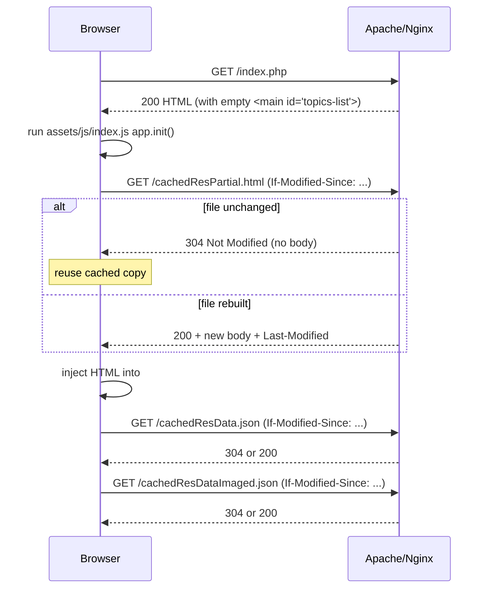

# Cached Files — How They Work and How to Serve Them

This guide explains the three generated "cache files" at the repo root, how the browser caches them, and how to configure Apache or Nginx so caching behaves correctly. For the companion topic of gzip/brotli compression, see the section at the bottom.

---

## 1. What the cache files are

There are three files at the repo root whose names start with `cached`. They are all **generated artifacts** — never edit them by hand. They are rebuilt by `npm run build-<brain>` (see [package.json](package.json)).

| File | Built by | Size (current) | Purpose |
|---|---|---|---|
| [cachedResData.json](cachedResData.json) | [cache_data.js](cache_data.js) | ~2.5 MB | Full file tree of `curriculum/` — folders, notes, paths, IDs, sort spec. Used by the frontend for random-note, search, and folder-path lookups. |
| [cachedResDataImaged.json](cachedResDataImaged.json) | [cache_data_imaged.js](cache_data_imaged.js) | ~260 KB | Subset of the tree containing only notes that have images. Used to prioritize "Random Note" toward visually rich notes. |
| [cachedResPartial.html](cachedResPartial.html) | [cache_render.js](cache_render.js) | ~2.0 MB | Pre-rendered topics-tree HTML (`<ul class="ul-root">…`) that populates `<main id="topics-list">` on the page. |

Note the naming split:
- **`cache_*.js`** — Node build scripts that _generate_ the cache files. These are source code, not cached data. They are NOT the targets of browser caching.
- **`cachedRes*`** — generated output files, served to the browser.

The `.htaccess` / Nginx rules below match `^cached.*` so they catch the outputs but never the generator scripts.

## 2. How they are served

Before the current setup, `cachedResPartial.php` was `include()`-ed server-side into [index.php](index.php). That meant every page load re-sent the full 2 MB tree as part of the HTML response, which the browser could not cache separately.

The flow is now:



Key points:
- [index.php](index.php) line ~275 renders `<main id="topics-list">` as an empty container.
- [assets/js/index.js](assets/js/index.js) `app.init()` fetches `cachedResPartial.html`, injects it, sets `window.__topicsReady = true`, then dispatches a `topics-ready` event.
- Other scripts ([assets/js/note-opener.js](assets/js/note-opener.js), [assets/js/link-popover.js](assets/js/link-popover.js), [assets/js/private-auth.js](assets/js/private-auth.js), and `initFolderOptionsAndAI` in [assets/js/index.js](assets/js/index.js)) defer their DOM setup until `topics-ready` fires.

## 3. Cache strategy: conditional revalidation

We want: **"use the browser's stored copy unless the file's last-modified timestamp differs."**

This is implemented with HTTP **conditional GET**, not with a long `max-age`:

1. On the first request, the server returns `200 OK` with `Last-Modified: <mtime>` and `ETag: <hash>`.
2. The browser stores the body.
3. On every subsequent request, the browser sends `If-Modified-Since: <that mtime>` and `If-None-Match: <that etag>`.
4. The server stats the file:
   - mtime/etag match → **`304 Not Modified`**, empty body, ~200 bytes on the wire. Browser serves its stored copy.
   - mtime/etag differ → **`200 OK`** with the new body and new headers.

The header that makes this happen is:

```
Cache-Control: no-cache, must-revalidate
```

Despite the name, **`no-cache` does NOT mean "don't cache"** — it means "you may store, but you must revalidate with the server before reusing." This is exactly the behavior we want. `must-revalidate` adds a safety rule that stale responses must never be served if the server is reachable.

We deliberately do NOT use `max-age=<large>`, because that would let the browser reuse stale data for up to that many seconds without asking the server — meaning a rebuild of the cache files wouldn't be picked up until the TTL expires.

## 4. Apache setup (.htaccess)

The config lives in [.htaccess](.htaccess) at the repo root. Apache automatically emits `Last-Modified` and `ETag` for static files; we only need to set `Cache-Control` and pin the ETag algorithm.

```apache
# Browser cache policy for generated cache outputs.
#
# Target files (at repo root):
#   cachedResData.json
#   cachedResDataImaged.json
#   cachedResPartial.html
#
# Strategy: conditional-GET revalidation.
# Apache auto-emits Last-Modified + ETag for static files. "no-cache" here
# means the browser MAY store the response but MUST revalidate with the server
# on each request. When the file's mtime is unchanged, Apache answers 304 and
# the browser serves its cached copy. When the file has been rebuilt (e.g. by
# `npm run build-devbrain`), its mtime changes and the browser gets the fresh
# body. This gives us "use the browser's copy unless the last-modified differs".
<IfModule mod_headers.c>
    <FilesMatch "^cached.*\.(json|html)$">
        Header set Cache-Control "no-cache, must-revalidate"
        Header unset Pragma
        Header unset Expires
    </FilesMatch>
</IfModule>

# Make ETag strong by basing it on mtime + size (no inode, so it survives
# filesystem moves / replicas).
FileETag MTime Size
```

### Requirements
- Apache 2.4+ (any mainstream shared host).
- `mod_headers` enabled — the `<IfModule>` guard makes the block a no-op if it's not, but then `Cache-Control` won't be set. Check with `apachectl -M | grep headers` or just look at response headers.
- `AllowOverride` must permit `FileInfo` and `Indexes` for the directory, or `.htaccess` directives are ignored. On shared hosts this is usually already allowed for the docroot.

### Verifying on Apache

```bash
# First request: should return 200 and Cache-Control
curl -sI https://your.host/app/devbrain/cachedResPartial.html

# Conditional request: should return 304 with no body
curl -sI -H 'If-Modified-Since: Wed, 01 Jan 2020 00:00:00 GMT' \
  https://your.host/app/devbrain/cachedResPartial.html
# ^ Using a future date would get 304; using a very old date gets 200.
#   Copy the actual Last-Modified from the first response to test 304 cleanly:
LM=$(curl -sI https://your.host/app/devbrain/cachedResPartial.html | awk -F': ' '/^Last-Modified/{print $2}' | tr -d '\r')
curl -sI -H "If-Modified-Since: $LM" https://your.host/app/devbrain/cachedResPartial.html
```

Expected on the conditional request:
```
HTTP/1.1 304 Not Modified
Cache-Control: no-cache, must-revalidate
ETag: "..."
```

In browser DevTools → Network, you should see a ~200-byte `304` response on reloads, and the body column labelled "(disk cache)" or "(memory cache)".

## 5. Nginx setup (server block / vhost)

Nginx doesn't read `.htaccess`; configuration lives in your site file, typically `/etc/nginx/sites-available/<site>.conf` or `/etc/nginx/conf.d/<site>.conf`. Add a `location` block inside the `server { ... }` that serves this app:

```nginx
server {
    listen 443 ssl http2;
    server_name your.host;
    root /var/www/your.host/app/devbrain;
    index index.php index.html;

    # ... your existing PHP handler, SSL config, etc ...

    # Conditional-GET revalidation for generated cache outputs.
    # Nginx auto-emits Last-Modified; enabling etag on (default in 1.3.3+) pairs well.
    # "no-cache" tells the browser to store but always revalidate.
    location ~* ^/cached.*\.(json|html)$ {
        add_header Cache-Control "no-cache, must-revalidate" always;
        add_header Vary "Accept-Encoding" always;
        etag on;
        # Nginx sends 304 automatically when If-Modified-Since / If-None-Match match.
    }
}
```

After editing, reload Nginx:

```bash
sudo nginx -t          # syntax check
sudo systemctl reload nginx
```

### Notes for Nginx
- `etag on;` is the default in Nginx ≥ 1.3.3 but including it explicitly is self-documenting.
- Use `add_header … always` so the header is sent on both `200` and `304` responses. (Without `always`, Nginx suppresses `add_header` on non-2xx/3xx responses in older versions.)
- If you also use `gzip on;` or `brotli on;`, Nginx handles the ETag / `Vary` interaction correctly on modern versions. Keeping the `Vary: Accept-Encoding` header explicit prevents any proxy from serving a compressed body to a client that didn't ask for it.
- If this app lives under a URL prefix (e.g. `/app/devbrain/`), the `location` regex matches the URI path, so either anchor it to your prefix or use a nested `location`:
  ```nginx
  location /app/devbrain/ {
      location ~* ^/app/devbrain/cached.*\.(json|html)$ {
          add_header Cache-Control "no-cache, must-revalidate" always;
          etag on;
      }
  }
  ```

### Verifying on Nginx

```bash
curl -sI https://your.host/app/devbrain/cachedResPartial.html
# Expect: 200, Last-Modified, ETag, Cache-Control: no-cache, must-revalidate

LM=$(curl -sI https://your.host/app/devbrain/cachedResPartial.html \
       | awk -F': ' '/^Last-Modified/{print $2}' | tr -d '\r')
curl -sI -H "If-Modified-Since: $LM" https://your.host/app/devbrain/cachedResPartial.html
# Expect: 304 Not Modified
```

## 6. Troubleshooting

| Symptom | Likely cause | Fix |
|---|---|---|
| Always `200`, never `304`, on Apache | `mod_headers` not loaded, or `AllowOverride` doesn't permit `FileInfo` | `a2enmod headers && systemctl restart apache2`, and allow overrides in the vhost. |
| Stale data shown after a rebuild | A proxy/CDN in front is caching past the origin's `Cache-Control` | Add `Cache-Control: public, no-cache, must-revalidate` and/or a `Surrogate-Control: no-store` if you want the CDN excluded entirely. |
| ETag mismatches after switching servers | Default Apache ETag includes inode, which changes per filesystem | The provided `FileETag MTime Size` already handles this. Confirm the directive isn't overridden elsewhere. |
| Browser shows full 2 MB download on every reload in DevTools | Either the header isn't being sent, or the user has "Disable cache" ticked in DevTools | Uncheck "Disable cache" in the Network tab while verifying; recheck headers with `curl -I`. |
| `If-None-Match` sent but origin still returns `200` | Compression layer mangled the ETag (Apache used to suffix `-gzip`) | Modern Apache handles this correctly. If needed, add `RequestHeader edit "If-None-Match" "^\"(.*)-gzip\"$" "\"$1\""`. |

## 7. Relationship to compression (gzip / brotli)

Caching and compression are independent layers:

- **Caching** saves a round trip from re-sending the body. A `304` response has no body, so compression is irrelevant for that path.
- **Compression** shrinks the body on `200` responses (cache misses and first loads). For these highly redundant text files, gzip typically compresses `cachedResPartial.html` from ~2.0 MB to ~200–250 KB and `cachedResData.json` from ~2.5 MB to ~450–550 KB. Brotli is 15–25% smaller again.

If you want to enable compression, the relevant Apache module is `mod_deflate` (and optionally `mod_brotli`):

```apache
<IfModule mod_deflate.c>
    AddOutputFilterByType DEFLATE application/json
    AddOutputFilterByType DEFLATE text/html
    AddOutputFilterByType DEFLATE text/css application/javascript image/svg+xml
</IfModule>
<IfModule mod_brotli.c>
    AddOutputFilterByType BROTLI_COMPRESS application/json
    AddOutputFilterByType BROTLI_COMPRESS text/html
    AddOutputFilterByType BROTLI_COMPRESS text/css application/javascript image/svg+xml
</IfModule>
```

And on Nginx, inside `http { ... }` or the `server { ... }`:

```nginx
gzip on;
gzip_comp_level 6;
gzip_min_length 1024;
gzip_types application/json text/html text/css application/javascript image/svg+xml;
gzip_vary on;

# Requires nginx-module-brotli
# brotli on;
# brotli_comp_level 5;
# brotli_types application/json text/html text/css application/javascript image/svg+xml;
```

Compression is not currently enabled in this repo's `.htaccess` — add the block above if you want the first-load speedup. The caching rules are orthogonal and don't need to change.
