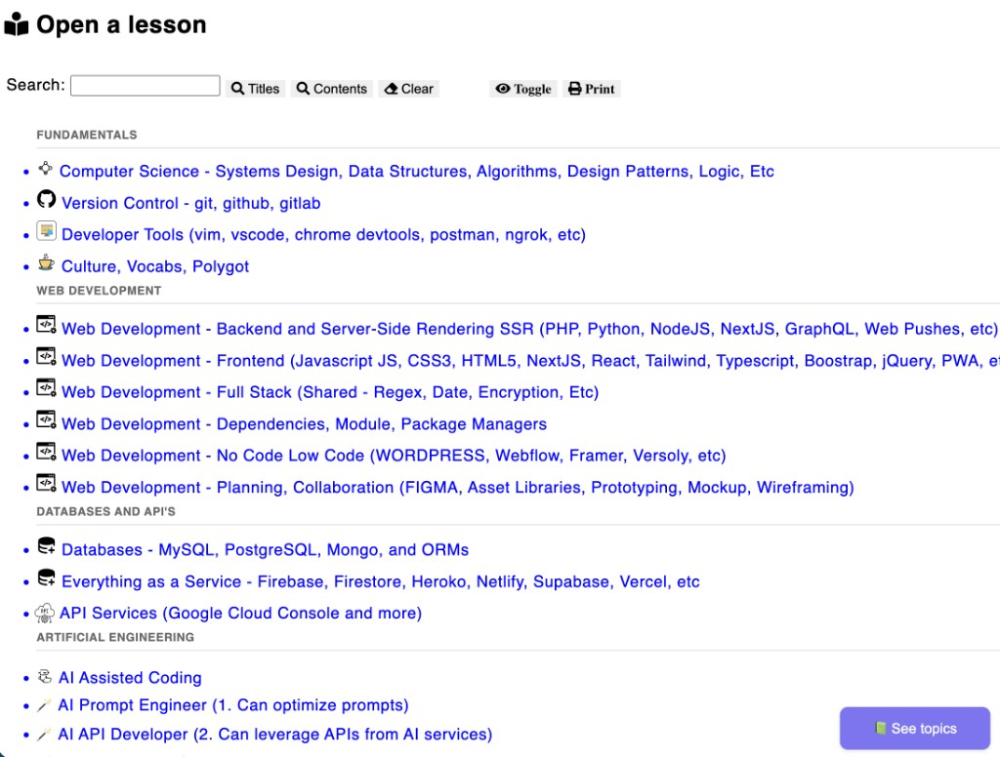

# Custom headings in the topic navigator

The small gray labels above groups of topics — **Fundamentals**, **Web Development**, **Databases and API's**, **Artificial Engineering** — are not folders. They are section headings written in `sortspec.md` at the root of `curriculum/`.



## Where the text comes from

Put `sortspec.md` next to your top-level topic folders:

```
curriculum/
  sortspec.md
  Computer Science - Systems Design, Data Structures, Algorithms, Design Patterns, Logic, Etc/
  Version Control - git, github, gitlab/
  ...
```

The file uses Obsidian Custom Sort YAML. Only the indented list inside `sorting-spec` is read. A line that starts with `---` and then a title becomes a heading. The folders listed under that line stay in that group.

```markdown
---
sorting-spec: |-
  --- Fundamentals
  Computer Science - Systems Design, Data Structures, Algorithms, Design Patterns, Logic, Etc
  Version Control - git, github, gitlab
  --- Web Development
  Web Development - Backend and Server-Side Rendering SSR (PHP, Python, NodeJS, NextJS, GraphQL, Web Pushes, etc)
  Web Development - Frontend (Javascript JS, CSS3, HTML5, NextJS, React, Tailwind, Typescript, Boostrap, jQuery, PWA, etc)
  --- Databases and API's
  Databases - MySQL, PostgreSQL, Mongo, and ORMs
  --- Artificial Engineering
  AI Assisted Coding
  ---
  README
  sortspec
---
```

The heading is the words after `---`, copied as written. `Fundamentals` is what you type. The page shows `FUNDAMENTALS` because `.explorer-divider__title` in `assets/css/index.css` uses `text-transform: uppercase`.

| Line inside `sorting-spec` | What the navigator shows |
|------|--------------------------|
| `--- Fundamentals` | Uppercase heading **FUNDAMENTALS**, then a rule, then the folders listed below it |
| `---` | A rule with no heading |
| `%` | Same as a plain `---` |

Folder names on the other lines must match the folder on disk exactly. A heading line is not a folder name.

## How the build applies them

During `npm run build-*`:

1. `cache_data.js` reads `sortspec.md` and stores the file text in `cachedResData.json` as `sort_spec`.
2. `cache_render.js` parses the `sorting-spec` list. A `--- Title` line becomes `<li class="explorer-divider explorer-divider--section">` with the title in `.explorer-divider__title`.
3. The result is written into `cachedResPartial.html`, which the topic list loads.

Edit `sortspec.md`, then rebuild (for example `npm run build-devbrain`). The headings do not update until that rebuild.

## Related docs

- [README - Custom Sort and Categories.md](README%20-%20Custom%20Sort%20and%20Categories.md) — folder order, omitted folders, and the same `sortspec.md` file
- [README.md](README.md) — organizing folders and files
