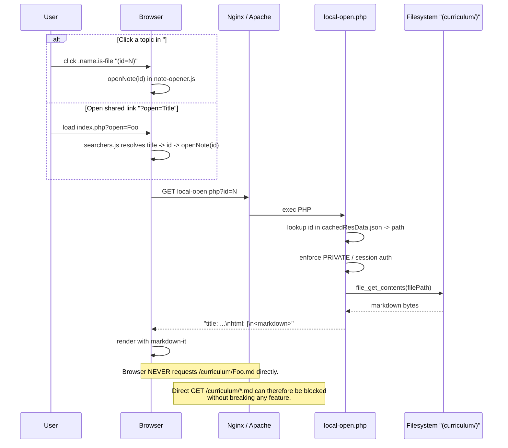

# Protect MD Files — Block Direct HTTP Access to Raw Notes

This guide explains why raw `.md` files under `curriculum/` should not be reachable by URL, how the app already avoids needing them over HTTP, and how to add a block rule to Apache (`.htaccess`) or Nginx (vhost / CloudPanel). For the companion topic of browser caching of the generated artifacts, see [README - Cached Files Guide.md](README - Cached Files Guide.md).

---

## 1. What this protects and why

On the deployed site the `curriculum/` folder sits inside the web root (it's pulled from a separate repo by `curriculum/server-update.php`, see [README - Online Migration Guide.md](README - Online Migration Guide.md)). That means — by default — a visitor can paste a URL like:

```
https://your.host/app/devbrain/curriculum/Some%20Folder/Some%20Note.md
```

…and the webserver will happily serve the raw markdown straight off disk. That leaks two things at once:

1. **Content bypass.** The note renders in the browser as plain text, skipping the app entirely.
2. **Private-note bypass.** [local-open.php](local-open.php) is the one place that enforces the private-notes gate (files ending in `PRIVATE.md` / `(PRIVATE).md` and folders ending in `(PRIVATE)` / `PRIVATE`, see [LLM_CODE_REFERENCE-private.md](LLM_CODE_REFERENCE-private.md)). A direct `GET …/curriculum/…PRIVATE.md` never runs that code, so the session check in `isPrivateAuthenticated()` is never consulted.

The fix is not in the app — it's a one-line block at the webserver layer that refuses any request whose path ends in `.md` under `curriculum/`.

## 2. How `.md` loads today

Both entry points into a note — clicking a topic, or opening a shared link — resolve to the same internal call: `openNote(id)`, which fetches a **PHP endpoint**, not an `.md` URL.



The four code anchors that make this true:

- **Click handler.** In [assets/js/index.js](assets/js/index.js) `setupExploreInteractions()` binds every `.name.is-file` element and calls `openNote(id)` with the `data-id` attribute. No `.md` path is constructed.
- **Shared-link handler.** In [assets/js/searchers.js](assets/js/searchers.js), `setupCanReceiveSharedNote_Or_SharedSearch` polls until `folders` is loaded, then `_openNoteFromUrl` matches the `?open=<title>` string to an entry in `window.folders` and calls `openNote(folderMeta.id)`. Same code path as a click.
- **Network fetch.** In [assets/js/note-opener.js](assets/js/note-opener.js), `openNote(id)` does `fetch("local-open.php?id=" + id)`. The browser never requests an `.md`.
- **Server-side read.** [local-open.php](local-open.php) resolves the `id` against `cachedResData.json` to get `$result["path"]` (an absolute filesystem path), runs the PRIVATE check, then returns `file_get_contents($filePath)` wrapped in a `title: …\nhtml: |\n<body>` envelope.

Search is also filesystem-only: [search.php](search.php) shells out to `pcregrep -ri … "$DIR_SNIPPETS"`, never to HTTP.

## 3. Why blocking is safe

Because nothing in the client ever hits an `.md` URL, a `404` on `curriculum/**/*.md` is invisible to normal users and only trips up someone probing directly. Confirmed by searching `assets/js/**` for `fetch(…md)` — zero hits.

This block is therefore **purely additive**: it does not interact with the `cached*.html|json` cache-control rules already in [.htaccess](.htaccess).

## 4. Apache setup (.htaccess)

Append the block below to the existing [.htaccess](.htaccess) at the repo root. The repo-root `.htaccess` applies recursively, so a single rule covers every subfolder — no need to drop a second `.htaccess` into `curriculum/` (which some shared hosts disable with `AllowOverride None`).

```apache
# Block direct HTTP access to raw markdown notes under curriculum/.
# The app never fetches .md over HTTP; notes are served by local-open.php
# via file_get_contents on the filesystem, which also enforces PRIVATE gating.
<IfModule mod_rewrite.c>
    RewriteEngine On
    RewriteRule ^curriculum/.*\.md$ - [R=404,L,NC]
</IfModule>

# Fallback if mod_rewrite is unavailable on the host.
# Broader than the rewrite rule above (matches any .md anywhere), but only
# takes effect when mod_rewrite isn't loaded.
<IfModule !mod_rewrite.c>
    <FilesMatch "(?i)\.md$">
        Require all denied
    </FilesMatch>
</IfModule>
```

### Flag choice: `[R=404,L,NC]` vs `[F]` (403)

- `R=404` — returns "Not Found". Preferred here because it does not confirm that the file exists on disk; a scraper enumerating URLs gets the same response whether the note is real or not.
- `[F]` (403 Forbidden) — also works, but advertises "there's something here, you just can't have it."
- `L` stops rewrite processing for this request. `NC` makes the match case-insensitive so `.MD` and `.Md` are caught too.

### Requirements

- Apache 2.4+.
- `mod_rewrite` loaded. Verify with `apachectl -M | grep rewrite`. If absent, the `<IfModule !mod_rewrite.c>` fallback kicks in.
- `AllowOverride` on the docroot must permit at least `FileInfo` (for `RewriteRule`) and `AuthConfig` (for `Require`). On shared hosts this is typically already set.

## 5. Nginx setup (server block / vhost)

Nginx ignores `.htaccess`. Add a `location` block inside the `server { ... }` that serves this app. Nginx's `location ~*` is case-insensitive by default, so `.md` / `.MD` / `.Md` are all caught.

```nginx
server {
    listen 443 ssl http2;
    server_name your.host;
    root /var/www/your.host/app/devbrain;

    # ... your existing SSL, PHP handler, etc ...

    # Block direct access to raw markdown under curriculum/.
    # The app serves notes through local-open.php (filesystem read + PRIVATE gate),
    # so a 404 here is invisible to normal users and only blocks direct probing.
    location ~* ^/curriculum/.+\.md$ {
        return 404;
    }
}
```

### URL-prefix variant (apps mounted at `/app/devbrain/`)

If the app isn't at the site root, anchor the path:

```nginx
location ~* ^/app/devbrain/curriculum/.+\.md$ {
    return 404;
}
```

Or nest it inside the existing app `location`:

```nginx
location /app/devbrain/ {
    location ~* ^/app/devbrain/curriculum/.+\.md$ {
        return 404;
    }
}
```

After editing:

```bash
sudo nginx -t          # syntax check
sudo systemctl reload nginx
```

## 6. CloudPanel / two-tier Nginx — put it in the 443 block

CloudPanel (and many panel-managed hosts) split Nginx into a public-facing 443 server block that serves static files, and an internal 8080 block that fronts `php-fpm`. Raw `.md` files are **static files** — the 443 block sees the request and answers it straight from disk. That means:

> **Add the `location ~* ^/…curriculum/.+\.md$` block to the 443 server block, not the 8080 one.**

Putting it only in 8080 is the same "I added it but nothing changed" trap documented in [README - Cached Files Guide.md](README - Cached Files Guide.md) §5. The 443 front-end never consults the 8080 config for static paths.

On CloudPanel the file is usually:

```
/etc/nginx/sites-enabled/<domain>.conf
```

Minimal shape (abridged):

```nginx
# === 443: public-facing, serves static + proxies PHP to 8080 ===
server {
    listen 443 ssl http2;
    server_name your.host;
    root /home/<site-user>/htdocs/your.host;

    # Block raw markdown — lives HERE, in the public block.
    location ~* ^/app/devbrain/curriculum/.+\.md$ {
        return 404;
    }

    # PHP still proxies to the backend so local-open.php continues to work.
    location ~ \.php$ {
        proxy_pass http://127.0.0.1:8080;
        proxy_set_header Host $host;
        proxy_set_header X-Real-IP $remote_addr;
        proxy_set_header X-Forwarded-For $proxy_add_x_forwarded_for;
        proxy_set_header X-Forwarded-Proto $scheme;
    }
}

# === 8080: internal PHP backend — nothing to add here ===
server {
    listen 127.0.0.1:8080;
    server_name your.host;
    root /home/<site-user>/htdocs/your.host;

    location ~ \.php$ {
        include snippets/fastcgi-php.conf;
        fastcgi_pass unix:/run/php/php8.x-fpm-<site-user>.sock;
    }
}
```

Reload the same way:

```bash
sudo nginx -t && sudo systemctl reload nginx
```

CloudPanel's per-site "Vhost" editor edits the 443 block too, so pasting the `location` there works equivalently.

## 7. Verification

Pick a real note path and test four things: blocked `.md`, allowed images, allowed PHP endpoint, allowed repo-root docs.

```bash
# 1. Direct markdown must be blocked. Expect: HTTP/1.1 404 Not Found
curl -sI 'https://your.host/app/devbrain/curriculum/Some%20Folder/Some%20Note.md'

# 2. Note images must still load. Expect: 200
curl -sI 'https://your.host/app/devbrain/curriculum/img/example.png'

# 3. The PHP endpoint the app actually uses must still work. Expect: 200
curl -sI 'https://your.host/app/devbrain/local-open.php?id=1'

# 4. Repo-root docs are out of scope and should still serve. Expect: 200
curl -sI 'https://your.host/app/devbrain/README.md'
curl -sI 'https://your.host/app/devbrain/LLM_CODE_REFERENCE.md'
```

Also open the app in a browser and click a topic in `#topics-list`, then try a `?open=<title>` shared link — both should render the note normally, confirming the block did not affect the real code path.

## 8. Troubleshooting

| Symptom | Likely cause | Fix |
|---|---|---|
| `.md` still returns `200` on Apache | `mod_rewrite` not loaded, or `AllowOverride` disallows `FileInfo` | `a2enmod rewrite && systemctl restart apache2`; allow `FileInfo` in the vhost. The `<IfModule !mod_rewrite.c>` fallback will also cover this case. |
| `.md` still returns `200` on Nginx / CloudPanel | Rule placed in the 8080 backend block only | Move it into the public 443 server block. See §6. |
| Rule appears to work locally but not on the host | Case difference — file is `Foo.MD`, rule matched `.md` only | Both snippets above already use case-insensitive matching (`NC` on Apache, `~*` on Nginx). Confirm you didn't edit that out. |
| `curriculum/img/foo.png` returns `404` | Regex accidentally broadened to `curriculum/.*` without the `\.md$` anchor | The rule must end in `\.md$`. Re-check the expression; images have no `.md` suffix and are not matched by the correct rule. |
| App works but `local-open.php?id=N` returns note text for a PRIVATE note without auth | The block rule doesn't change PRIVATE gating — that logic lives inside `local-open.php` | This guide does not modify PRIVATE gating; see [LLM_CODE_REFERENCE-private.md](LLM_CODE_REFERENCE-private.md). |
| New rule conflicts with an existing `RewriteRule` | Apache `.htaccess` processes rules top-to-bottom; an earlier rule with `[L]` or a `RewriteBase` can shadow later ones | Place the `.md` block BEFORE any broader rewrites, or add `[L]` to the `.md` rule and verify order. |
| Status shows `403` instead of `404` | A host-level `Require` / `deny` rule fired before the rewrite | Swap `[R=404,L,NC]` for `[F,L,NC]` if a 403 is acceptable, or investigate the higher-scope rule. |

## 9. What this does NOT protect

This rule is a surgical fix for one leak (raw markdown URLs). It intentionally does not touch:

- **`cachedResData.json`.** The JSON served to the browser includes the absolute server path of every note (e.g. `/Users/.../Drive/.../Foo.md` in dev, or `/home/<user>/htdocs/.../curriculum/Foo.md` in prod). If that path disclosure matters for your threat model, strip `path` from the JSON at build time in [cache_data.js](cache_data.js) (keep `path_tp`, `id`, `current`, `next`) — the frontend only uses `id` and `current`. That is a separate change, not part of this guide.
- **`local-open.php?id=N` output.** This endpoint still returns the full markdown body of any non-PRIVATE note to anyone who can guess an `id`. The PRIVATE gate inside the PHP is the only access control; if you need stricter protection (e.g. per-note ACL), it has to be added there.
- **`search.php` output.** Matches are echoed as raw pcregrep lines that include filesystem paths and line content. Any hardening — gating, path-stripping, rate limiting — has to live inside that script.

## 10. Relationship to existing configs

This block is additive to [.htaccess](.htaccess):

- The existing `<FilesMatch "^cached.*\.(json|html)$">` `Cache-Control` rule and the `FileETag MTime Size` directive from [README - Cached Files Guide.md](README - Cached Files Guide.md) are unaffected — they match a disjoint set of filenames.
- The rewrite rule is outside any `FilesMatch`, so the two blocks coexist without ordering constraints.
- No Node build script, `.env` value, or PHP endpoint needs to change.

In short: one snippet added in one place per server type, zero code changes, and the app keeps working exactly as it does today — minus the raw-markdown leak.
