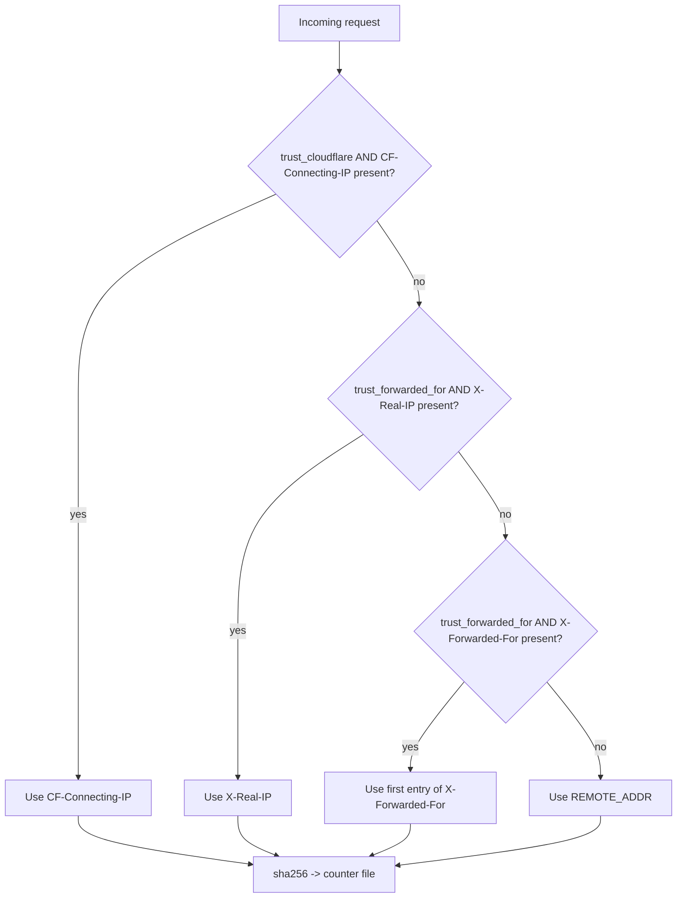

# Throttle Note Requests — Anti-Scraping for `local-open.php`

Companion to [README - Protect MD Files Guide.md](README - Protect MD Files Guide.md). That guide blocks the direct `.md` URL. This guide rate-limits the PHP endpoint that legitimately serves notes, so a scraper can't just walk `?id=1`, `?id=2`, `?id=3`, … and pull the whole knowledge base.

---

## 1. What this does

[local-open.php](local-open.php) is the single entry point for note content (see §2 of the Protect MD Files Guide). Before it resolves `?id=N`, it now keeps a short sliding-window counter per client IP. If a client exceeds the configured rate, the endpoint returns **HTTP 429 Too Many Requests** with a `Retry-After` header and a friendly cooldown message that the frontend renders in place of the note body.

Shipping default (from [config-throttle.json](config-throttle.json)) — the **Cloudflare + CloudPanel** shape described in §3:
- **4 requests per 30 seconds** per IP.
- Authenticated PRIVATE users are **not** auto-bypassed — the limit applies to everyone so a logged-in tab can't be used as an unthrottled scraping channel.
- `X-Forwarded-For` / `X-Real-IP` are **not** trusted. CloudPanel terminates TLS and talks to PHP over loopback, so those headers can be set by anything on the public edge that isn't Cloudflare.
- `CF-Connecting-IP` **is** trusted — the box is assumed to be locked down to Cloudflare's IP ranges (§5), which makes that header authoritative.

If you're not on Cloudflare, see §3's "No Cloudflare" recipe — it's the same file with `trust_cloudflare` flipped off.

## 2. How it works

```mermaid
sequenceDiagram
    participant B as Browser
    participant P as local-open.php
    participant C as temp/throttle/&lt;sha256(ip)&gt;.json

    B->>P: GET local-open.php?id=N
    P->>P: load config-throttle.json
    alt config missing / enabled=false
        Note over P: fail-open — skip throttle
    else enabled=true
        P->>P: resolve client IP (REMOTE_ADDR, optionally XFF)
        P->>C: read timestamps in last window_seconds
        alt count &gt;= max_requests
            P-->>B: 429 Too Many Requests<br/>Retry-After: window_seconds<br/>YAML envelope with cooldown_message
        else under limit
            P->>C: append now + save
            P->>P: continue to id lookup + PRIVATE gate + file_get_contents
            P-->>B: 200 with note body
        end
    end
```

Key properties:

- **Sliding window**, not fixed bucket. Old timestamps (outside `window_seconds`) are dropped every read, so the counter self-heals — a user who waits out the window is immediately unblocked.
- **File-per-IP-hash** under `temp/throttle/`. No database, no PHP extension (APCu/Redis) required. Works on every shared host that runs the rest of the app.
- **sha256(ip)** for the filename so the directory contents don't read as a list of visitor IPs. The IP itself never lands on disk.
- **Fail-open** if the config file is missing, unreadable, or the storage dir is not writable. The goal is to never cost you a reader because of a misconfiguration.
- **Opportunistic cleanup** on ~1% of requests removes counter files untouched for 24h, so the folder doesn't grow unboundedly.

## 3. Configuration — [config-throttle.json](config-throttle.json)

Two recipes cover almost every deployment. Pick one, drop it into [config-throttle.json](config-throttle.json), done. The field-by-field reference is below if you want to deviate.

### Recipe A — Cloudflare in front of CloudPanel (recommended, shipping default)

Origin is locked to Cloudflare IPs (§5), so `CF-Connecting-IP` is authoritative. Everything else — including CloudPanel's own `X-Forwarded-For` / `X-Real-IP` — is ignored, because on a Cloudflare-fronted host those headers are only as trustworthy as whatever set them on the public edge. With the origin firewalled to Cloudflare, only Cloudflare can set `CF-Connecting-IP`, and that's the one we key off.

```json
{
    "enabled": true,
    "max_requests": 4,
    "window_seconds": 30,
    "storage_dir": "temp/throttle",
    "cooldown_message": "**Slow down.** You're opening notes too quickly. Please wait a moment and try again.",
    "bypass_authenticated_private": false,
    "trust_forwarded_for": false,
    "trust_cloudflare": true
}
```

### Recipe B — No Cloudflare, PHP served directly

No reverse proxy above CloudPanel, or CloudPanel talking straight to the internet on 443. `REMOTE_ADDR` is already the real client on this topology, so both trust flags stay off — the moment you flip either one on, a scraper can forge the header and rotate through an infinite supply of fake IPs.

```json
{
    "enabled": true,
    "max_requests": 4,
    "window_seconds": 30,
    "storage_dir": "temp/throttle",
    "cooldown_message": "**Slow down.** You're opening notes too quickly. Please wait a moment and try again.",
    "bypass_authenticated_private": false,
    "trust_forwarded_for": false,
    "trust_cloudflare": false
}
```

If you have a bare CloudPanel / nginx 443→8080 split in front of PHP but **no** Cloudflare, see §4 — that's the one case where `trust_forwarded_for: true` is correct.

### Field reference

| Field | Type | Recipe A / B | Meaning |
|---|---|---|---|
| `enabled` | bool | `true` | Master switch. Set `false` to disable throttling entirely without removing the code. |
| `max_requests` | int | `4` | How many note opens are allowed inside `window_seconds`. The N-th+1 request in the window returns 429. |
| `window_seconds` | int | `30` | Rolling window length. |
| `storage_dir` | string | `"temp/throttle"` | Where per-IP counter files live. Absolute paths OK; relative paths resolve against the script dir. Auto-created with `0755`. |
| `cooldown_message` | string | (see json) | Shown to the user when throttled. Markdown is rendered by the frontend's existing `markdown-it`. |
| `bypass_authenticated_private` | bool | `false` | If `true`, visitors who unlocked private notes via the 🔑 key icon (session flag `private_auth`) skip the throttle. Kept off in both recipes so a logged-in session can't be weaponised as an unthrottled scraping channel. |
| `trust_forwarded_for` | bool | `false` | If `true`, the IP is read from `X-Real-IP` / `X-Forwarded-For`. Only enable this behind a trusted reverse proxy that strips inbound copies of those headers (e.g. a bare CloudPanel 443 → 8080 with **no** Cloudflare in front); otherwise clients can spoof the header and evade the limit. |
| `trust_cloudflare` | bool | Recipe A `true`, Recipe B `false` | If `true`, the IP is read from `CF-Connecting-IP` (Cloudflare's real-client header). Only safe when the origin is firewalled to Cloudflare's IP ranges or using Authenticated Origin Pulls (§5), otherwise a scraper can set the header directly. Takes priority over `trust_forwarded_for` when both are on. |

**Header priority when multiple trust flags are on:**

1. `CF-Connecting-IP` — when `trust_cloudflare` is `true`
2. `X-Real-IP` — when `trust_forwarded_for` is `true`
3. first entry of `X-Forwarded-For` — when `trust_forwarded_for` is `true`
4. `REMOTE_ADDR` — always, as the final fallback

### When to change the defaults

- **Tighten** (`max_requests: 2`, `window_seconds: 60`) if you're under active scraping. A legitimate human rarely opens more than a couple of notes in a minute.
- **Loosen** (`max_requests: 10`, `window_seconds: 30`) if you have power users who click through quickly — e.g. while answering a question from the notes.
- **Disable** (`enabled: false`) for local dev so a fast refresh loop doesn't trip on itself.

### Tuning rule of thumb

Think of a real reading session: click a note → read for ≥5s → click the next. Even a fast reader does ~6 notes per 30s. Defaults (4/30s) are intentionally below that to catch scrapers but the `bypass_authenticated_private` lets you keep real power usage untouched if you're logged into private notes. If you find yourself getting throttled during normal use, that's a signal to raise `max_requests` rather than disable the feature.

## 4. Running behind a local reverse proxy (CloudPanel, nginx 443→8080)

The PHP script sees `$_SERVER['REMOTE_ADDR']`. When PHP is on the internal 8080 tier that only talks to the 443 front-end, `REMOTE_ADDR` is `127.0.0.1` for **every** visitor — which means all your readers share a single counter and throttle each other. Symptom: "the limit trips way too fast under real traffic."

Fix: enable the header-based path **and** make sure the 443 block forwards the header.

1. In [config-throttle.json](config-throttle.json):
    ```json
    "trust_forwarded_for": true
    ```
2. In your CloudPanel / Nginx 443 server block (the public-facing one), confirm the PHP `location` passes the original client IP to the backend:
    ```nginx
    location ~ \.php$ {
        proxy_pass http://127.0.0.1:8080;
        proxy_set_header Host              $host;
        proxy_set_header X-Real-IP         $remote_addr;
        proxy_set_header X-Forwarded-For   $proxy_add_x_forwarded_for;
        proxy_set_header X-Forwarded-Proto $scheme;
    }
    ```

The PHP prefers `X-Real-IP` when present, then falls back to the first address in `X-Forwarded-For`. Both are already set by default in CloudPanel; if you're on bare Nginx, the snippet above is what you want.

**Only turn `trust_forwarded_for` on if you really do have a trusted proxy in front.** On a box that serves PHP directly to the internet, enabling it lets any scraper rotate fake `X-Forwarded-For` values and bypass the limit entirely.

## 5. Running behind Cloudflare

If your site is proxied through Cloudflare (the orange cloud is on), every request hits your origin from a **Cloudflare edge IP**, not the visitor. `REMOTE_ADDR` will be one of ~a few hundred Cloudflare addresses — so either everyone shares a bucket and throttles each other, or the `X-Forwarded-For` chain has the real client buried behind one or more Cloudflare hops that an ordinary reverse-proxy setup doesn't parse correctly. Either way, the throttle appears broken online even though it worked locally.

Cloudflare solves this cleanly with a dedicated header:

```
CF-Connecting-IP: <the real client IP>
```

Cloudflare sets this on every request it proxies, it's always the original client, and it needs no parsing. That's what `trust_cloudflare` reads.

### Setup

1. Set the flag in [config-throttle.json](config-throttle.json):
    ```json
    "trust_cloudflare": true
    ```
2. That's it at the app level. No Nginx / CloudPanel changes are strictly required, because Cloudflare sets `CF-Connecting-IP` before any reverse proxy in your stack forwards it — and `proxy_set_header Host $host` / the default forwarding in CloudPanel already carries arbitrary request headers through to PHP.

### Header priority with `trust_cloudflare: true`



On a CloudPanel box that is also behind Cloudflare, the shipping recipe (§3, Recipe A) is `trust_cloudflare: true` and `trust_forwarded_for: false`. `CF-Connecting-IP` is the only header we trust, which is only safe because the origin is firewalled to Cloudflare (see "close off direct-to-origin access" below). `trust_forwarded_for: true` is **not** a useful fallback here: on a Cloudflare-fronted origin, any request that bypasses Cloudflare and reaches PHP directly also controls `X-Forwarded-For` / `X-Real-IP`, so turning that flag on hands the scraper the same per-request-rotation bypass we're trying to prevent. If Cloudflare ever stops setting `CF-Connecting-IP`, the throttle harmlessly falls through to `REMOTE_ADDR` (every request hashes to the same Cloudflare edge IP → one global bucket → the endpoint goes cold very quickly), which is a louder failure mode than silently trusting a spoofable header.

### Important: close off direct-to-origin access

`CF-Connecting-IP` is only trustworthy **when the request actually came from Cloudflare**. PHP can't see the TLS handshake, so it has no way to tell a real Cloudflare hop from a direct TCP connection that happens to set the header itself. Without one of the mitigations in this subsection, `trust_cloudflare: true` only protects you against honest scrapers — anyone who bothers to find your origin IP walks around the limit.

#### How the bypass works

**Honest (naive) scraper** — hits `your.host/...` like a browser would:

1. DNS resolves `your.host` → Cloudflare edge IP.
2. Request goes through Cloudflare.
3. Cloudflare sets `CF-Connecting-IP: <their-real-IP>` and proxies to the origin.
4. PHP reads the header → per-client bucket works → throttle fires correctly.

**Dishonest scraper** — finds your origin IP and skips Cloudflare entirely:

```
scraper  ── TCP 443 ──►  1.2.3.4 (your origin)
              with forged header:
              CF-Connecting-IP: 203.0.113.<rand>
```

```bash
curl -k --resolve your.host:443:1.2.3.4 \
     -H 'CF-Connecting-IP: 203.0.113.42' \
     'https://your.host/app/devbrain/local-open.php?id=1'
```

Your PHP has no way to tell this request didn't come from Cloudflare — the TCP connection is a normal TLS request on port 443, the header is present, and `trust_cloudflare` says "trust it." PHP writes the counter to `sha256(203.0.113.42)`. The next request uses `203.0.113.43`, a brand new bucket. Per-request rotation → infinite fresh buckets → the scraper walks the whole corpus at full speed.

#### How scrapers find your origin IP

Origin IPs are less hidden than most people assume:

- **Historical DNS** — `crt.sh`, `viewdns.info`, SecurityTrails store the A record your domain had before you enabled the orange cloud.
- **Certificate transparency logs** — Let's Encrypt publishes every cert, including ones issued to subdomains (`mail.your.host`, `dev.your.host`) that often resolve to the same box and aren't proxied.
- **Email headers** — mail from `postmaster@your.host` includes the mail server's IP in `Received:` headers; if mail and web run on the same host, game over.
- **Shodan / Censys** — full-IPv4 scans correlate by the Common Name on the TLS certificate. If your origin serves a cert for `your.host`, it's findable.
- **Misconfigured error pages, xmlrpc, `.git` exposure** — any of these can echo back the internal or external IP.

#### Two standard fixes

Both close off the "bypass Cloudflare and connect directly" attack vector, rather than trying to detect the forged header after the fact:

| Fix | Mechanism | Effect on forged requests |
|---|---|---|
| **Firewall origin to Cloudflare IP ranges** | Kernel drops the SYN from any IP not in Cloudflare's published ranges | Scraper's TCP connection never completes. PHP never runs. |
| **Cloudflare Authenticated Origin Pulls** | Origin TLS requires a Cloudflare-signed client cert during handshake | Scraper's TLS handshake fails. PHP never runs. |

Either one turns "forge `CF-Connecting-IP` to any value you like" into "can't reach the app at all except via Cloudflare's edge, which won't let you forge the header."

##### Firewall snippet (ufw)

Cloudflare publishes the ranges at `https://www.cloudflare.com/ips-v4` and `https://www.cloudflare.com/ips-v6`. They change rarely but occasionally, so refresh on a schedule (a weekly cron is plenty):

```bash
# Drop everything on 443 by default
sudo ufw deny 443/tcp
# Then allow only Cloudflare ranges
for ip in $(curl -s https://www.cloudflare.com/ips-v4); do
    sudo ufw allow from "$ip" to any port 443 proto tcp
done
```

##### Authenticated Origin Pulls

Cloudflare dashboard → **SSL/TLS → Origin Server → Authenticated Origin Pulls**. Cloudflare presents a client certificate to your origin; your origin rejects any TLS connection without it. Stricter than IP filtering and survives Cloudflare's IP-range changes without a cron refresh.

#### Why PHP doesn't do the peer-IP check itself

It's technically possible to validate `REMOTE_ADDR` against Cloudflare's published ranges inside [local-open.php](local-open.php) and ignore `CF-Connecting-IP` whenever the TCP peer isn't a real Cloudflare node. That would give app-level protection even without firewall / AOP.

It isn't built in today because:

- The range list has to be refreshed periodically (Cloudflare adds / removes ranges a few times a year). A stale list starts blocking real traffic; keeping it fresh is operational overhead.
- Closing the origin at the network layer is Cloudflare's own recommendation and is strictly stronger — it blocks scraping, DDoS floods, credential stuffing, and anything else in one shot, not just this one throttle.

If you want belt-and-suspenders in-PHP validation on top of a firewall, it's a small config addition — a `cloudflare_ip_ranges` array that the throttle checks `REMOTE_ADDR` against before trusting `CF-Connecting-IP`. Not enabled by default.

### Verify the header is arriving

Add a one-off debug line to [local-open.php](local-open.php) just inside the throttle block:

```php
error_log('throttle: ip=' . $clientIp . ' cf=' . ($_SERVER['HTTP_CF_CONNECTING_IP'] ?? '-') . ' xff=' . ($_SERVER['HTTP_X_FORWARDED_FOR'] ?? '-'));
```

Open a note, check your PHP error log (`/var/log/php8.x-fpm.log` or `tail -f` whatever path your host uses). You should see the real client IP in `cf=` and it should match `ip=`. Remove the line once confirmed — it logs visitor IPs.

## 6. What the client sees when throttled

The frontend fetches `local-open.php?id=N` with `fetch()`, which does not throw on 429 — it just returns the response body. The body is the same `title: … / html: | …` envelope that [assets/js/note-opener.js](assets/js/note-opener.js) already parses, so the cooldown message renders into the normal note-reading pane:

```
Title: Too many requests

Slow down. You're opening notes too quickly. Please wait a moment and try again.
```

Because `cooldown_message` goes through `markdown-it`, you can style it — bold, italics, a link to contact email, etc. — by editing the string in [config-throttle.json](config-throttle.json).

## 7. Testing

Temporarily set `max_requests: 2, window_seconds: 30` to make this easy to reproduce.

```bash
# Pick any real note id from cachedResData.json.
URL='https://your.host/app/devbrain/local-open.php?id=1'

# 1st and 2nd: 200 OK.
curl -s -o /dev/null -w "%{http_code}\n" "$URL"
curl -s -o /dev/null -w "%{http_code}\n" "$URL"

# 3rd inside the window: 429 Too Many Requests.
curl -s -o /dev/null -w "%{http_code}\n" "$URL"

# Headers confirm the throttle fired.
curl -sI "$URL" | grep -iE 'http/|retry-after'

# Wait out the window, then it clears.
sleep 35
curl -s -o /dev/null -w "%{http_code}\n" "$URL"
```

In a browser, you can reproduce by opening the same note repeatedly via `?open=<title>` or by mashing notes in the topics list. The note-reading pane will show the cooldown message instead of the note.

Don't forget to restore `max_requests`/`window_seconds` afterwards.

## 8. Troubleshooting

| Symptom | Likely cause | Fix |
|---|---|---|
| Throttle worked locally but not online behind Cloudflare | `REMOTE_ADDR` is a Cloudflare edge IP, so all visitors hash into a tiny set of shared buckets. | Set `trust_cloudflare: true`. PHP will read `CF-Connecting-IP` instead. See §5. If your origin is reachable bypassing Cloudflare, also firewall the origin to Cloudflare's IP ranges (§5). |
| Every real user shares one counter; limit trips under normal traffic | PHP sits behind a reverse proxy and sees `REMOTE_ADDR = 127.0.0.1`. The counter key is the same for everyone. | Set `trust_forwarded_for: true` and confirm the 443 block forwards `X-Real-IP` / `X-Forwarded-For`. See §4. |
| Nothing is ever throttled, even with a loop of 100 curls | `enabled: false`, config file missing, `storage_dir` not writable, or `bypass_authenticated_private` is on and you're logged in. | Check `ls -ld temp/throttle/` is writable by the PHP user; `cat config-throttle.json`; log out of private notes. |
| `temp/throttle/` does not exist after the first request | PHP user can't `mkdir` there. The throttle silently fails open. | `mkdir -p temp/throttle && chown <php-user> temp/throttle` (or `chmod 0775` if group-owned). |
| Users report "Slow down" message even after `npm run build-*` rebuild | Their counter file is still young (<30s). Also possible if you forgot to actually persist a config change — reload your editor, confirm JSON validity with `php -r "print_r(json_decode(file_get_contents('config-throttle.json'), true));"`. | Wait out the window, or delete the specific counter file: `rm temp/throttle/*.json`. |
| Malformed JSON throws a 500 | Every other read of `config-throttle.json` is defensive, but invalid JSON produces `null` and falls through to fail-open — the 500 would be from something else in the endpoint. | `php -l config-throttle.json` is not a thing; run `json_decode` as shown above, or use `jq . config-throttle.json`. |
| A scraper trivially evades the limit | They're either rotating IPs (you'd need a CDN-level rule like Cloudflare rate limiting) or forging `X-Forwarded-For` with `trust_forwarded_for` wrongly enabled on a host that is NOT behind a trusted proxy. | Leave `trust_forwarded_for: false` unless you have a proxy; for IP-rotation scrapers, move this logic up to the webserver or CDN layer (out of scope for this PHP-level throttle). |

## 9. What this does NOT cover

- **`search.php`** still runs an unthrottled `pcregrep` across the whole corpus. A determined scraper could harvest content through search queries. If that matters to you, extend this same pattern into [search.php](search.php) (read the config, key off IP, maintain a separate counter file under `temp/throttle/search/`).
- **Static assets under `curriculum/img/**`** are served by the webserver, not PHP, so this throttle never sees them. Those are public by definition.
- **Per-note ACLs.** Any visitor who stays under `max_requests` can still read every non-PRIVATE note. This is about slowing scraping, not about access control. Access control stays in [local-open.php](local-open.php)'s PRIVATE gate and [LLM_CODE_REFERENCE-private.md](LLM_CODE_REFERENCE-private.md).
- **Distributed scrapers** (rotating cloud IPs). File-based single-server throttling can't see them as a group. For that, a CDN-level rule (Cloudflare → "Rate Limiting Rules") or a WAF is the right layer.

## 10. Relationship to existing configs

This feature adds one new file ([config-throttle.json](config-throttle.json)) and one runtime directory (`temp/throttle/`, gitignored). It does not change:

- [.htaccess](.htaccess) — still the cache-control rules from the cached-files guide, plus the `.md` block from the protect guide.
- [local-open.php](local-open.php) — the PRIVATE gate and `file_get_contents` read are unchanged; the throttle runs as a self-contained block above them.
- [cachedResData.json](cachedResData.json) — unchanged.
- Frontend JS — unchanged. The existing `fetch` + YAML-envelope parsing naturally handles the 429 response because the body uses the same envelope shape.

Disable by flipping `enabled` to `false` in the config. No code change required.
