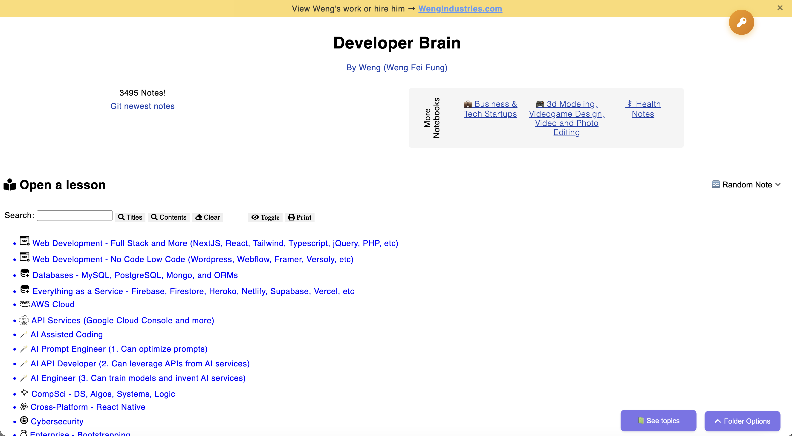
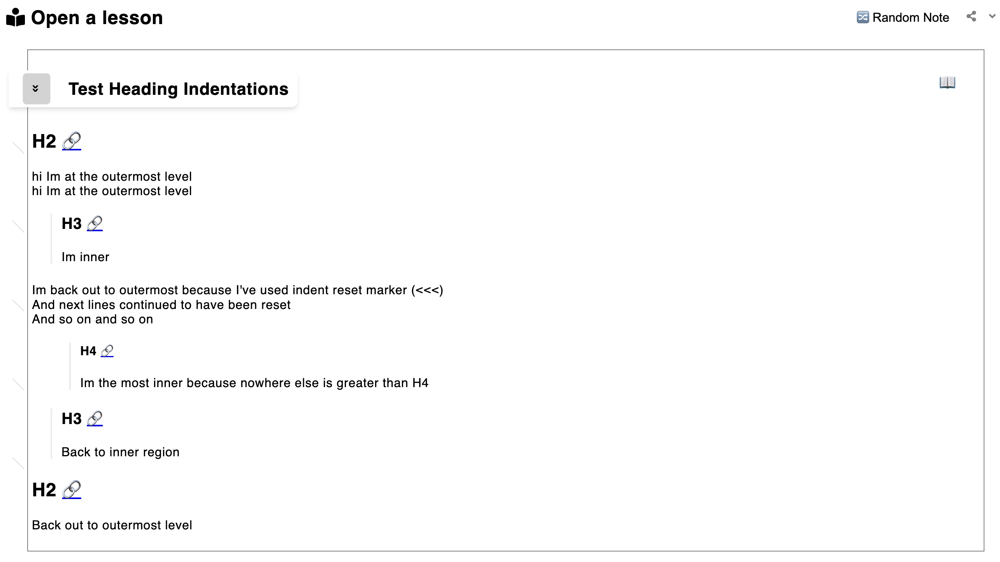
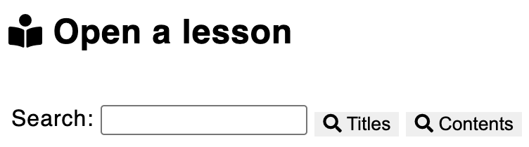

# Notes Brain Engine

By Weng Fei Fung.

## Quick Summary

• **DevBrain** is a knowledge management engine that transforms Markdown notes into an interactive, searchable web application with full-text search, hierarchical organization, AI-assisted content generation, click-to-expand image modals, and robust AGE encryption support with Node.js fallback for seamless password-protected note handling
• Built with PHP backend (1900+ lines total including 1411-line AGE encryption handler with Node.js fallback), JavaScript frontend (6000+ lines across 12 files including 1681-line mindmap system and 399-line encryption client with console logging), and Node.js build pipeline optimized for handling thousands of notes efficiently
• Features enhanced Markdown support (Obsidian-style links, collapsible sections, math equations), automatic mindmap generation from lists using Mermaid.js with interactive controls, link popover previews with custom text support, fullscreen image viewing, and robust encryption/decryption capabilities with Node.js ES module support
• Powers multiple knowledge collections (developer, 3D modeling, business, health) with template-based multi-brain architecture and automated publishing pipeline for transforming Obsidian vaults into public-facing knowledge bases
• Includes automatic image hosting, path rewriting, deployment scripts, comprehensive modal system, and encryption support for seamless content management and enhanced user experience

*For comprehensive technical documentation optimized for AI code generation, see [context.md](./context.md) and specialized context files below*

## AI Context Documentation

This project includes comprehensive context documentation designed specifically for AI code generation and assistance:

- **[context.md](./context.md)** (278 lines) - **START HERE**: Complete high-level overview with tech stack, architecture, and code flow including enhanced encryption system
- **[context-architecture.md](./context-architecture.md)** (126 lines) - System architecture, caching pipeline, multi-brain template system
- **[context-encryption.md](./context-encryption.md)** (181 lines) - Enhanced AGE encryption system with Node.js fallback, ES module support, TTY resolution, console logging, and security features
- **[context-features.md](./context-features.md)** (157 lines) - Enhanced markdown, search, publishing pipeline, UI features, AI integration
- **[context-tech-stack.md](./context-tech-stack.md)** (161 lines) - Backend/frontend technologies, build system, external integrations
- **[context-mindmap.md](./context-mindmap.md)** (253 lines) - Interactive mindmap system with Mermaid.js implementation
- **[context-link-preview.md](./context-link-preview.md)** (234 lines) - Link popover preview system with CORS handling

**Total: ~1180 lines across 6 focused files, optimized for AI context windows with file size guidance for efficient code generation**

---

A powerful engine for working with thousands of notes across various topics. It reads your folder of Markdown documents, displays them as an organized collection, and enables full-text search across your notes. It also includes a publishing pipeline that transforms your authored notes in Obsidian into a public-facing collection.

Write effortlessly using Obsidian or your preferred Markdown editor—no coding required. With the image-handling pipeline enabled, new local images are automatically uploaded to your image hosting server, eliminating manual steps. The engine also rewrites image paths with a custom URL prefix, making your notes' images ready for web publishing.



The Notes Brain Engine has powered Weng's thousands of notes on coding, 3d animation, business, and health.
- Developer notes: [http://wengindustry.com/tools/devbrain/](http://wengindustry.com/tools/devbrain/)
- 3d notes: [http://wengindustry.com/tools/3dbrain/](http://wengindustry.com/tools/3dbrain/)
- Business notes (Tech Startups): [http://wengindustry.com/tools/bizbrain/](http://wengindustry.com/tools/bizbrain/)
- Health notes: [http://wengindustry.com/tools/healthbrain/](http://wengindustry.com/tools/healthbrain/)

## Contribute to the Brain Notes Negine
- Help make the engine even better. Please make sure to describe your pull requests.

## Contribute knowledge

You can contribute knowledge to Weng's notes at:
- Contribute Developer notes: https://github.com/Siphon880gh/devbrain/
- Contribute 3d notes: https://gitlab.com/Siphon880gl/3dbrain
- Contribute Business notes: https://gitlab.com/Siphon880gl/bizbrain
- Contribute Health notes: https://gitlab.com/Siphon880gl/healthbrain

## Organizing the folders and files

Folders of MD files. For a beefed up version that is more than MD files, you can have .JSON files. Take a look at JSON Example section below. Place these in curriculum/.

Note that the curriculum at this repo is empty but the deployed app still renders content at <a target="_blank" href="https://wengindustry.com/tools/devbrain/">the demo (developer notees)</a>. For the curriculum content, visit my [Coding Snipppets and Guides repository](https://github.com/Siphon880gh/devbrain). I chose to separate the content so people can contribute guides and snippets more easily. My deployment server automatically combines this repo with the curriculum repo as a pipeline. This applies to my 3d notes and business notes as well.

### JSON Example

```
{
    "titleOverridden": "I overridden",
    "desc": "HTML or text description here",
    "summary": ["<b>This is <u>text</u>.</b> It is in the json file as an array of strings that will be will separated as <br> lines when rendered. ",
                "And you can jump to a text containing title ",
                "<a href=\"javascript:void(0)\" onclick=\"scrollToRow('I overridden')\">I overridden</a>"
               ],
    "footerFile": "./test.txt",
    "gotos": [
        ".",
        "./readme.md",
        "http://www.google.com"
    ]
}
```

## Referring to other notes from a note

You can jump to different concepts from a summary.
```
"<a href=\"javascript:void(0)\" onclick=\"scrollToRow('I overridden')\">I overridden</a>"
```

Or you can actually link like this `[[Other note name]]` - if authoring, you should use like Obsidian which can autocomplete as you're typing into the double brackets.

## Rewrite your MD articles using AI.

You can paste your entire note into ChatGPT and ask it to improve the writing for clarity and readability. If you're using Obsidian, be sure to mention that it should preserve markdown image links, like ![[Pasted image 20250607063721.png]], since ChatGPT will often remove or ignore these unless explicitly told not to.

Prompt:
```
I’m pasting in a note that I need you to change into article form. Please rewrite it to improve clarity and flow, but preserve all markdown images exactly as they are.
```

## Heading Indentations

The Notes Brain Engine supports visual indentation of content based on heading levels. This creates a hierarchical structure where content under deeper headings (H3, H4, etc.) appears indented relative to content under shallower headings (H2).



Here's a test snippet demonstrating heading indentations:

```
## H2

hi Im at the outermost level
hi Im at the outermost level

### H3
Im inner

<<<

Im back out to outermost because I've used indent reset marker (`<<<`)
And next lines continued to have been reset
And so on and so on

#### H4
Im the most inner because nowhere else is greater than H4

### H3
Back to inner region

## H2
Back out to outermost level
```

To reset all indentations from a line onwards, use the indent reset marker:

```

<<<

```

**Important formatting requirements:**
- Empty line before and after the `<<<` marker must be there
- No trailing spaces on any of those lines


## Searching snippets

Users can search by topic title or contents. The search bars are to the top of the topics explorer. This tool uses pcregrep to search files.



## Templates

To change the layout of your document, add the following YAML frontmatter at the top.

Brain Collection Notes currently supports only one layout option: center. Will add more if people expressed interest.

```
---
brain_layout: center
---
```

## Future Features (If requested)

### Rating Importance
- Thermometer icon clicking goes from empty, to partially filled, to completely filled, and you can make it to mean whatever you want. It could mean how important the concept is to focus on.

### Rating Mastery
- Rate your mastery (parentheses = maybe will fail, square brackets = definitely failed, checked = recalled well, checked inside parenthesis or square brackets = redemption later but also tracks if you will have the same difficulties months later).
  - To the right is possibly a blank area enclosed by left and right gray vertical bars. There are actually four slots inside these bars. Clicking a slot will cycle through blank, parentheses and square brackets. They could mean unaddressed (blank), will need to review again until commits to memory (parentheses), and will need extra reviewing because it's having problems sticking (square brackets). When you complete a concept knowing that it's committed to memory, you can SHIFT+click, right-click or taphold (if on a phone), to add a checkmark to any of those states. So you can have something like a parentheses with checkmark inside. This will let you know the history of how hard a concept was.

  ## Technical Details on this note sharing technology I developed

### Mac workflow Obsidian to Terminal: 
I am authoring the `curriculum/` separately inside an Obsidian MD vault. I can manage the git repository by right clicking the curriculum folder in Obsidian -> Reveal in Finder -> New Terminal at Folder (on the highlighted folder in Finder). Now I can run git and other terminal commands.

### Enhanced markdown for brain notes app
- Having `[[TOPIC_TITLE]]` will create a link that opens topic of such name
- Having this syntax will add collapsible sections (HTML equivalent of details>summary+\*):
```
> [!note] HEADING
> Content
> Content
```
- Having this KaTeX (subset of LateX) or AsciiMath syntax will format math equations into easy to read format (Like exponentials are rendered as actually superscripts):
```
`$E = mc^2$`
`@(1/2[1-(1/2)^n])/(1-(1/2))=s_n@`
```

## Interactive Mindmap Generation

DevBrain automatically detects and generates interactive mindmaps from markdown lists containing placeholder images. This feature uses Mermaid.js to create beautiful, interactive visualizations.

### Creating Mindmaps

Use the `1x1.png` placeholder image in your markdown lists to trigger mindmap generation. The alt text of the image becomes the node text in the mindmap:

```markdown
# Web Development 

- Frontend Development 
  - React Components 
  - CSS Styling 
- Backend Development 
  - API Design 
  - Database 
```

### Mindmap Node Hierarchy

The mindmap hierarchy is based on the structure of your markdown:
- **H1, H2, H3... headings** with `1x1.png` images become root nodes
- **Nested list items** (`<li>`) with `1x1.png` images create child nodes
- **Alt text** of the `1x1.png` image becomes the node label in the mindmap

### Mindmap Features

- **Automatic Detection**: Green mindmap button appears when content is detected
- **Multiple Layouts**: Spider/radial (default), spread (organic force-based), tree top-down, tree left-right
- **Interactive Controls**: Zoom in/out, pan/drag (always enabled), reset zoom, fullscreen mode
- **Cycle Type Button**: Dynamic switching between layout types with sync icon
- **Responsive Design**: Works on desktop and mobile devices
- **Configuration**: Edit `config-mindmap.json` to change default layout

### Layout Types

Configure the mindmap layout in `config-mindmap.json`:

```json
{
  "mindmap": {
    "type": "spread"  // "spider", "spread", "tree", "tree-down", "tree-right"
  }
}
```

**Layout Types:**
- **spider**: Radial layout with central root (default)
- **spread**: Organic force-based layout with variable node repulsion based on hierarchy level, creating natural clustering and better space distribution
- **tree/tree-down**: Hierarchical tree flowing top-down
- **tree-right**: Hierarchical tree flowing left-right

## Link Preview with Selected Excerpt

DevBrain supports automatic link popover previews that display selected excerpts from external links or custom preview text without navigating away from the current page. This feature uses `1x2.png` marker images to trigger preview functionality.

### Creating Link Previews

#### External Content Extraction
Use the `1x2.png` placeholder image with ellipsis in the alt text to extract content from external links:

```markdown
[Example Website](https://example.com) 
[MDN Docs](https://developer.mozilla.org) 
[GitHub](https://github.com) 
```

#### Custom Preview Text
Use the `##` delimiter in the alt text to define custom preview text:

```markdown
[API](https://example.com) 
[CSS](https://example.com) 
[ML](https://example.com) 
```

More examples of boundary words for excerpt selection in link previews are at:
[README - Link Previews - Boundary Words Examples.md](README%20-%20Link%20Previews%20-%20Boundary%20Words%20Examples.md)


### Link Preview Features

- **Automatic Detection**: Finds links followed by `1x2.png` images
- **Smart Content Extraction**: Parses boundary words from image alt text and includes them in the excerpt
- **Custom Preview Text**: Define preview text directly using `##` delimiter (no external fetching)
- **CORS Handling**: Uses proxy service to bypass CORS restrictions for external content
- **Performance**: Caches results to avoid repeated requests for external content
- **Responsive Design**: Works on desktop and mobile devices with contextual positioning
- **Error Handling**: Graceful fallbacks for failed requests with user-friendly error messages

### Alt Text Formats

#### For External Content Extraction
The alt text should follow the ellipsis pattern to indicate the excerpt:
- **Format**: `startWord..endWord` or `startWord...endWord`
- **Purpose**: Shows the excerpt range that will be displayed in the preview
- **Example**: `JavaScript...Reference` displays excerpt from "JavaScript" to "Reference"

#### For Custom Preview Text
The alt text should follow the `##` delimiter pattern:
- **Format**: `linkText##previewText`
- **Purpose**: Left side becomes the link text, right side becomes the preview
- **Example**: `API##Application Programming Interface` shows "API" as link with custom preview
- **Behavior**: Link goes nowhere (href="#") and shows instant preview

### How It Works

#### External Content Extraction
1. **Detection**: Scans for links followed by `1x2.png` marker images
2. **Parsing**: Extracts boundary words from image alt text using `..` or `...` pattern
3. **Fetching**: Retrieves content from the linked URL via CORS proxy
4. **Extraction**: Finds text between the specified boundary words
5. **Display**: Shows the extracted content in a popover on hover

#### Custom Preview Text
1. **Detection**: Scans for links followed by `1x2.png` marker images
2. **Parsing**: Extracts link text and preview text from alt text using `##` pattern
3. **Link Modification**: Replaces link text and sets href to "#"
4. **Display**: Shows custom preview text instantly in popover on hover

### Server pipelines
My remote server has a script I can trigger from my local machine. I created a npm script called `deploy` that I can run locally.

When ran locally on Obsidian terminal or another local terminal, it pushes the curriculum changes to Github or Gitlab repository.

Then it'll open the secret PHP script on the remote server in your web-browser. For security, the remote script is authenticated with a passcode from the `deploy` script. The PHP script shows debug information on the web browser.

At the remote script, running as the user that had created the SSH key pair and shared the public key with Github or Gitlab, it pulls in and merges the changes forcefully to the remote server's curriculum. It's important that the same user that created the SSH key is the same one that pulled and merged (so root or non-root, and if non-root, which user). If you're getting hit with permission denied errors from Github/Gitlab when the remote server is pulling, for debugging purposes, the PHP script outputs the user, and then you can check that user's home directory's .ssh folder's public key's file contents against the Github/Gitlab's shared public key's contents.

In order for the server pipeline to work, I made sure there is good file permissions at SSH that allows the script uploaded by my FTP’s user’s group to have group write permissions to the folder the script write files to. If the script or the folder doesn’t have the same group ownership, I make sure they do by changing the group owners recursively on the folder with ``sudo chgrp -R GROUP FOLDER`.`` Finally, I made sure the owner group has write permission on the folder `sudo chmod -R g+w FOLDER`. In addition, since I occasionally connect remotely into SSH with root access, I add root to that group in case I might edit files on the fly during a SSH session (like vim, nano, emacs): `usermod -a -G GROUP root`

### Server Migrations

When migrated to new remote server, you can see debug information and know where to go from there. To display the debug information, at your curriculum, make a git commit, then push up to the cloud, then run npm run deploy  at your local development to connect to the php file at the remote server. Upon connecting there, the php will report remote server’s user, github/gitlab link it pulls and resets from.

See the user that was reported at the .php file. Make sure it’s not a root user and that the files on the server are owned by that user.

Go SSH into the remote terminal and run su USER  where USER is that non-root user. Check ownership of files and folders are of that non-root user.

Go into the brain’s curriculum/ folder and run to pull and reset:
git fetch origin; git reset --hard refs/remotes/origin/main

It could say dubious owner or directory. If it says that, it also gave you instructions to add as an exception

It could say “This key is not known by any other names.. are you sure you want to continue connecting..” say yes. If it is still denied, then you’ll have to pair SSH on your VPS to the gitlab/github.

If you have the repositories at different git repo services, you’ll have to test this for the different repos services. For example, my 3dbrain/curriculum, healthbrain/curriculum, and bizhealth/curriculum connects to Gitlab because I didn’t want git activity to show on my Github profile. I want only code related content at Github, so my devbrain/curriculum is on Github. You test for dubious owners/directories and denied / lack of SSH keys for a Github curriculum and for a Gitlab curriculum.

You also want to update the urls.json at the root of env/ and their template subfolders. This is because the url is used for “See what’s changed” and when sharing note link, and opening internal note mentions.

### Local Development Migrations

If your computer or local development changed, or you downlaoded from my repo, the frontend needs to be adjusted to point to your local copy of curriculum. I've kept the inside curriculum/ and the frontend as two separate repos. You adjust this at env/template-WHICH_BRAIN/dir-snippets.php and where it detects the host is local:

```
if (strpos($host, 'localhost') !== false) {
    // When viewing app in localhots, render MD notes from Obsidian Vault
    $DIR_SNIPPETS = ""; // <-- Adjust here adding the abs path to your local curriculum copy
} elseif // ...
```

### Multiple brain notes on the same server

You can have `brains/brain1`, `brains/brain2`, `brains/brain3` then at the folder containing the brains (`brains/`), you can have a package.json:

```
  "scripts": {
    "pull-brains": "cd 3dbrain && npm run pull && npm run build-3dbrain; cd ../bizbrain && npm run pull && npm run build-bizbrain; cd ../devbrain && npm run pull  && npm run build-devbrain; cd ../healthbrain && npm run pull && npm run build-healthbrain"
  }
```

Then whenever you need to update the brain code, make sure everything is pushed to your Github/Gitlab, and at your remote server or localhost `brains/`, run `npm run pull-brains`, which will run pull at every brain.

### Icon Attributions
- API icon on DevBrain is designed by:
<a href="https://www.vecteezy.com/vector-art/8328554-api-icon-style" class="text-underline font-size-sm" target="_blank">API Icon Style</a> by <a href="https://www.vecteezy.com/members/circlontech" class="text-underline font-size-sm">Circlon Tech</a> on <a href="https://www.vecteezy.com" class="text-underline font-size-sm">IconScout</a>
- Web Scraper icon on DevBrain is designed by:
<a href="https://iconscout.com/icons/online-scraper" class="text-underline font-size-sm" target="_blank">Online Scraper</a> by <a href="https://iconscout.com/contributors/Hopstarter" class="text-underline font-size-sm">Hopstarter</a> on <a href="https://iconscout.com" class="text-underline font-size-sm">IconScout</a>